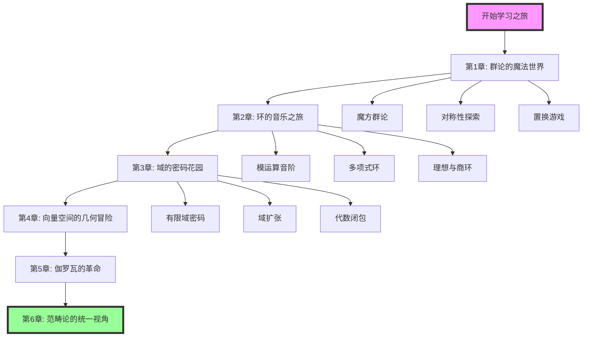

# 🎯 近世代数趣味学习指南

> 让抽象变具体，让学习变游戏！

## 📚 课程理念

近世代数被认为是数学中最抽象的分支之一，但它其实隐藏在我们生活的方方面面：
- 🎲 魔方的旋转中蕴含着群论
- 🎵 音乐的和弦里藏着环的结构  
- 🔐 网络安全依赖于有限域
- 🎨 艺术作品展现了对称群的美

本课程将通过**故事化、游戏化、可视化**的方式，让你轻松掌握近世代数的核心概念！

## 🗺️ 学习路线图

## 📖 章节介绍

### 🎲 第1章：群论的魔法世界
- **主题**：通过魔方理解群的概念
- **亮点**：
  - 魔方群的可视化探索
  - 对称性的艺术表现
  - 拉格朗日定理的游戏化证明
- **实践项目**：编写魔方求解器

### 🎵 第2章：环的音乐之旅  
- **主题**：音乐理论中的环结构
- **亮点**：
  - 十二音体系与模12运算
  - 和弦进行与理想
  - 音程关系与同态
- **实践项目**：创作数学音乐

### 🔐 第3章：域的密码花园
- **主题**：密码学中的有限域应用
- **亮点**：
  - RSA加密的数学原理
  - 椭圆曲线密码学
  - 纠错码理论
- **实践项目**：实现加密聊天工具

### 🌌 第4章：向量空间的几何冒险
- **主题**：线性代数与抽象代数的桥梁
- **亮点**：
  - 向量空间的视觉化
  - 线性变换的群结构
  - 张量积的直观理解
- **实践项目**：3D图形变换引擎

### ⚔️ 第5章：伽罗瓦的革命
- **主题**：方程求解的史诗故事
- **亮点**：
  - 伽罗瓦传奇人生
  - 可解群与五次方程
  - 伽罗瓦对应的美妙
- **实践项目**：方程可解性判定器

## 🎮 学习特色

### 1. 互动式学习
- 🧩 每章配有"数学侦探"解谜游戏
- 🎯 概念匹配卡片游戏
- 🏆 成就系统和进度追踪

### 2. 可视化工具
- 📊 Cayley图交互式生成器
- 🎨 群作用动画演示
- 📈 同态映射可视化

### 3. 实践项目
- 💻 每章都有编程项目
- 🔧 从理论到应用的完整链条
- 🌟 开源项目贡献机会

## 🛠️ 学习工具箱

- **概念速查手册**：快速查阅定义和定理
- **练习题库**：分级练习，循序渐进
- **在线计算器**：群表生成、多项式运算等
- **学习社区**：与同学讨论，互相帮助

## 🚀 开始你的旅程

1. **准备工作**
   - 基础要求：线性代数、离散数学基础
   - 推荐预习：集合论、初等数论
   
2. **学习建议**
   - 每天30-60分钟，持续学习
   - 理论与实践并重
   - 多做可视化，多写代码
   
3. **第一步**
   - 从[第1章：群论的魔法世界](chapters/chapter1-group-theory.md)开始
   - 完成魔方群论入门挑战
   - 加入学习社区，找到学习伙伴

## 💡 学习哲学

> "在数学中，艺术和科学相遇，在代数中，模式和结构共舞。"

记住：
- 🌟 每个抽象概念都有具体的例子
- 🎯 每个定理都有直观的理解
- 🚀 每个理论都有实际的应用

让我们一起开启这段奇妙的代数之旅吧！

---

*"代数是关于模式的科学，而模式无处不在。" - 让我们发现生活中的代数之美！*