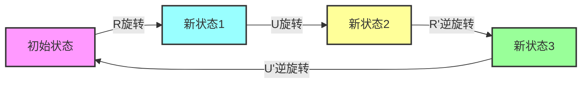
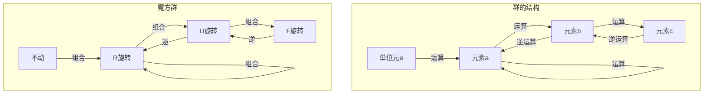
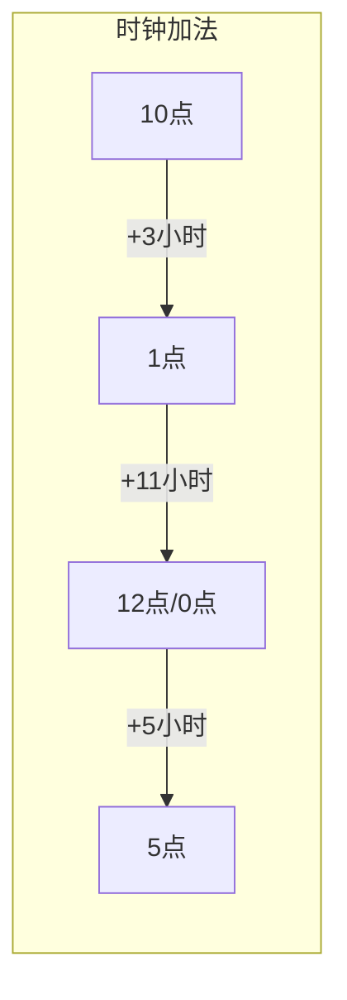
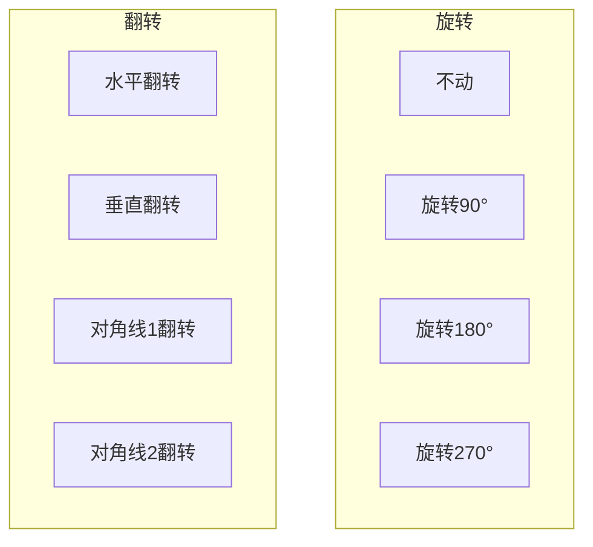
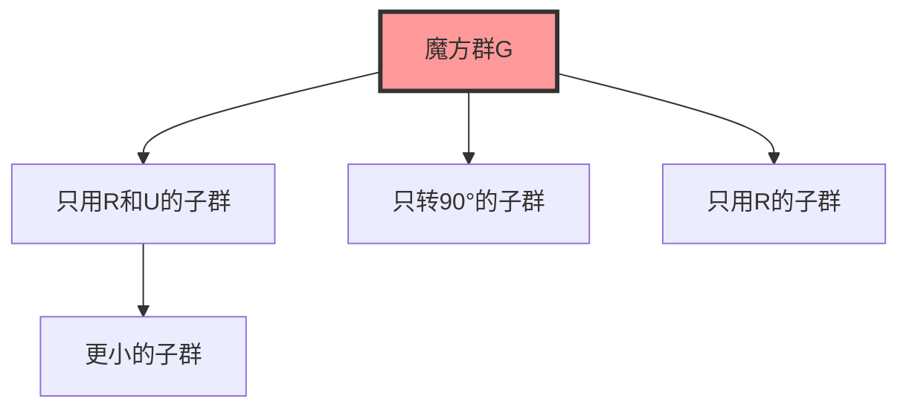
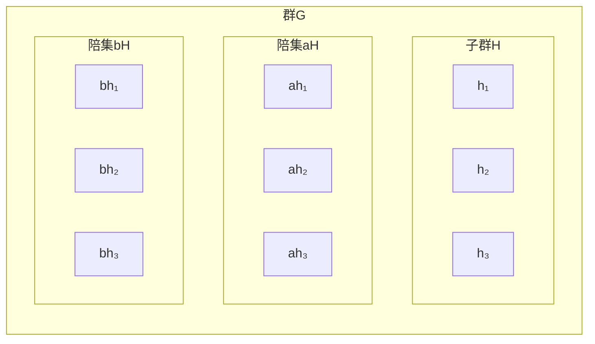
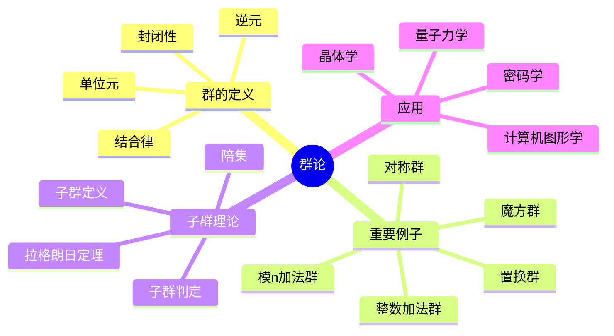

# 🎲 第1章：群论的魔法世界

> "魔方不仅是玩具，更是群论的完美模型！"

## 🌟 开篇故事：魔方大师的秘密

小明是个魔方高手，能在30秒内还原任何打乱的魔方。有一天，他的数学老师问他："你知道吗？你每次旋转魔方，其实都在进行一个数学运算！"

这个数学运算，就是**群论**的核心。

## 🎯 本章目标

学完本章，你将能够：
- ✅ 理解群的四个基本性质
- ✅ 用魔方解释子群和陪集
- ✅ 掌握对称群和置换群
- ✅ 证明拉格朗日定理
- ✅ 编写简单的群论计算程序

## 📐 1.1 什么是群？

### 🎮 魔方引入

想象你手中的魔方：



魔方的每个旋转操作都可以：
1. **组合**：先R后U = 执行RU
2. **逆转**：R的逆是R'
3. **不动**：不旋转 = 恒等操作

### 📝 群的定义

一个**群(Group)** (G, •) 需要满足四个条件：

#### 1️⃣ **封闭性(Closure)**
```
如果 a, b ∈ G，那么 a • b ∈ G
```
🎲 魔方例子：任意两个旋转的组合还是一个合法的魔方状态

#### 2️⃣ **结合律(Associativity)**
```
(a • b) • c = a • (b • c)
```
🎲 魔方例子：(R•U)•F = R•(U•F) - 操作顺序的分组不影响最终结果

#### 3️⃣ **单位元(Identity)**
```
存在 e ∈ G，使得对所有 a ∈ G：e • a = a • e = a
```
🎲 魔方例子：不做任何旋转就是单位元

#### 4️⃣ **逆元(Inverse)**
```
对每个 a ∈ G，存在 a⁻¹ ∈ G，使得：a • a⁻¹ = a⁻¹ • a = e
```
🎲 魔方例子：R的逆是R'（反向旋转）

### 🎨 可视化理解



## 🔍 1.2 群的例子大观园

### 🔢 整数加法群 (ℤ, +)
- 元素：所有整数 {..., -2, -1, 0, 1, 2, ...}
- 运算：普通加法
- 单位元：0
- 逆元：-n 是 n 的逆元

### 🕐 时钟算术群 (ℤ₁₂, +₁₂)


### 🎨 正方形对称群 D₄

正方形的8个对称操作：



### 🎯 置换群 S₃

三个元素{1, 2, 3}的所有置换：

```
e = (1)(2)(3)     不动
(12) = 交换1和2
(13) = 交换1和3  
(23) = 交换2和3
(123) = 1→2→3→1
(132) = 1→3→2→1
```

## 🏗️ 1.3 子群：群中之群

### 📖 定义
H是G的**子群**，记作 H ≤ G，如果：
1. H ⊆ G （H是G的子集）
2. H本身也是一个群

### 🎲 魔方的子群



### 🔍 子群判定法则

**一步判定法**：H ≤ G 当且仅当
```
对所有 a, b ∈ H：a • b⁻¹ ∈ H
```

## 🌟 1.4 拉格朗日定理

### 📐 陪集的概念

设H是G的子群，a ∈ G，则：
- **左陪集**：aH = {ah | h ∈ H}
- **右陪集**：Ha = {ha | h ∈ H}

### 🎨 陪集的可视化



### 🎯 拉格朗日定理

**定理**：如果G是有限群，H是G的子群，那么：
```
|G| = |H| × [G : H]
```
其中[G : H]是H在G中的指数（陪集个数）

**推论**：
1. 子群的阶整除群的阶
2. 元素的阶整除群的阶
3. 素数阶群必是循环群

## 🎮 1.5 实践项目：魔方群探索器

### 💻 Python实现基础群运算

```python
class RubiksCube:
    """魔方群的简化实现"""
    
    def __init__(self):
        self.state = self.solved_state()
        
    def R(self):
        """右面顺时针90度"""
        # 实现旋转逻辑
        pass
        
    def U(self):
        """上面顺时针90度"""
        # 实现旋转逻辑
        pass
        
    def compose(self, moves):
        """组合多个操作"""
        for move in moves:
            getattr(self, move)()
            
    def order_of_sequence(self, moves):
        """计算操作序列的阶"""
        temp = self.state.copy()
        count = 1
        self.compose(moves)
        
        while self.state != temp:
            self.compose(moves)
            count += 1
            
        return count
```

### 🧩 探索任务

1. **计算单个操作的阶**
   - R的阶是？(答案：4)
   - U的阶是？(答案：4)
   
2. **计算组合操作的阶**
   - RU的阶是？(答案：6)
   - RUR'U'的阶是？(答案：6)

3. **发现交换子**
   - [R,U] = RUR'U'是什么效果？
   - 为什么交换子很重要？

## 🎯 1.6 本章小结

### 核心概念思维导图



### 🏆 成就解锁

完成本章学习后，你已经：
- 🎖️ **群论入门者**：理解群的基本概念
- 🎖️ **魔方理论家**：用群论分析魔方
- 🎖️ **对称大师**：掌握对称群
- 🎖️ **拉格朗日传人**：理解并应用拉格朗日定理

## 📝 1.7 练习与挑战

### 🌟 基础练习

1. 证明：群的单位元是唯一的
2. 证明：每个元素的逆元是唯一的
3. 计算D₄（正方形对称群）的所有子群
4. 找出S₃的所有子群并画出子群格

### 🚀 进阶挑战

1. **魔方还原最少步数**
   - 使用群论证明：任何魔方状态都可以在20步内还原
   
2. **设计密码系统**
   - 基于循环群设计一个简单的加密方案
   
3. **对称性分类**
   - 分析不同正多边形的对称群结构

### 💡 思考题

> "如果把人类所有的动作看成一个群，什么是单位元？什么是逆元？"

## 🎬 下一章预告

在掌握了群的基本概念后，我们将进入更丰富的代数结构——**环**。想象一下，如果群是只有一种运算的世界，那么环就是有两种运算（加法和乘法）的世界。音乐中的和弦进行、多项式的运算，都隐藏着环的奥秘！

准备好了吗？让我们一起走进[第2章：环的音乐之旅](chapter2-ring-theory.md)！

---

*"群论告诉我们，对称性是宇宙的基本法则。" - 继续探索代数的奇妙世界！*