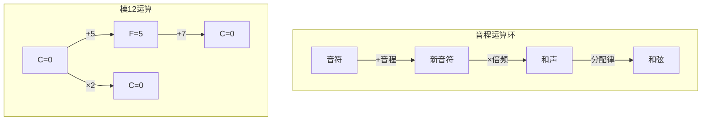
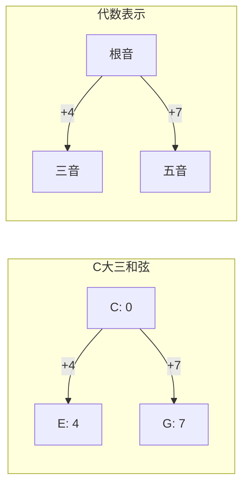
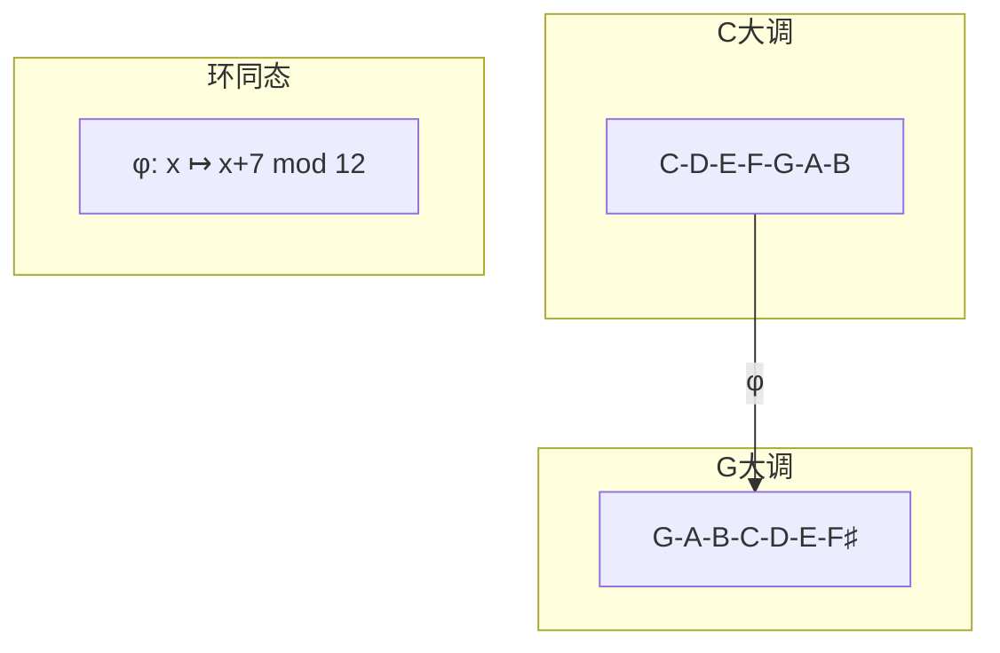
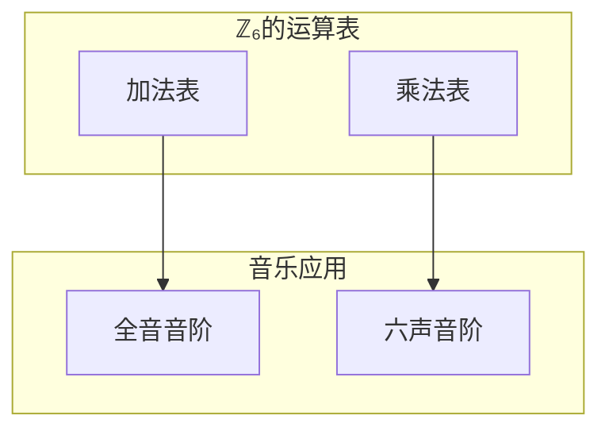
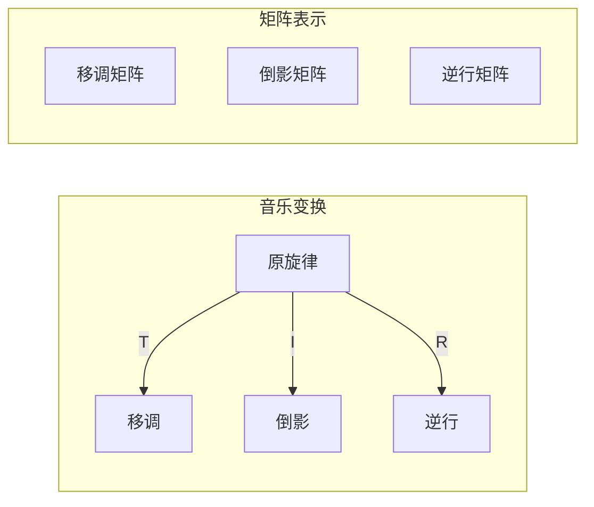
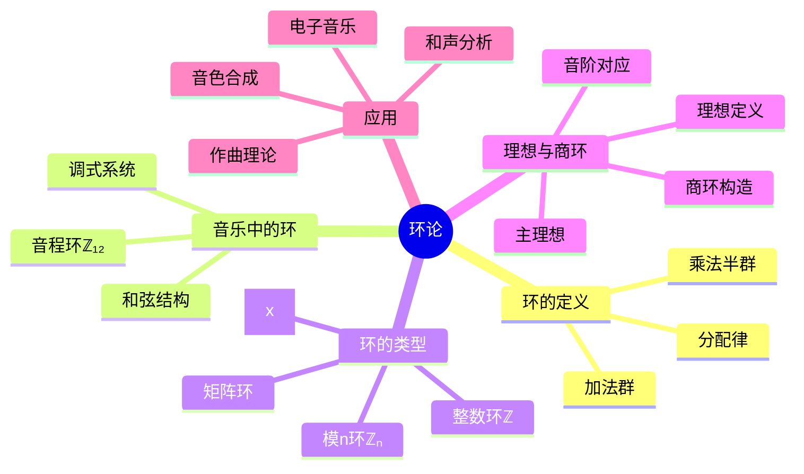

# 🎵 第2章：环的音乐之旅

> "音乐是数学的声音表达，而环论是音乐理论的代数基础。"

## 🎼 开篇故事：神秘的和弦密码

小雨是位年轻的作曲家，她发现了一个奇妙的现象：当她把C大调的七个音符按照特定规律组合时，总能创作出和谐动听的旋律。她的音乐理论老师告诉她："这不是巧合，而是环论在音乐中的体现！"

让我们跟随小雨，探索音乐背后的代数奥秘。

## 🎯 本章目标

学完本章，你将能够：
- ✅ 理解环的定义和基本性质
- ✅ 用音乐理论解释模运算环
- ✅ 掌握理想和商环的概念
- ✅ 理解多项式环的结构
- ✅ 创作"数学音乐"作品

## 🎹 2.1 什么是环？

### 🎵 音乐引入：十二音体系

西方音乐使用12个半音：

```mermaid
graph LR
    C --> C♯
    C♯ --> D
    D --> D♯
    D♯ --> E
    E --> F
    F --> F♯
    F♯ --> G
    G --> G♯
    G♯ --> A
    A --> A♯
    A♯ --> B
    B --> C2[C]
    
    style C fill:#f9f,stroke:#333,stroke-width:2px
    style C2 fill:#f9f,stroke:#333,stroke-width:2px
```

这12个音符形成一个循环，正好对应 **ℤ₁₂ = {0,1,2,...,11}**！

### 📝 环的定义

一个**环(Ring)** (R, +, ·) 需要满足：

#### 对于加法 (+)：
1. **(R, +) 是交换群**
   - 封闭性：a + b ∈ R
   - 结合律：(a + b) + c = a + (b + c)
   - 单位元：存在0，使得 a + 0 = a
   - 逆元：存在-a，使得 a + (-a) = 0
   - 交换律：a + b = b + a

#### 对于乘法 (·)：
2. **封闭性**：a · b ∈ R
3. **结合律**：(a · b) · c = a · (b · c)

#### 分配律连接加法和乘法：
4. **左分配律**：a · (b + c) = a · b + a · c
5. **右分配律**：(a + b) · c = a · c + b · c

### 🎨 音乐中的环结构



## 🎼 2.2 音乐理论中的环

### 🎹 音程加法环

在音乐中，音程的叠加就是模12加法：

```python
class MusicalInterval:
    """音程运算类"""
    
    def __init__(self, semitones):
        self.semitones = semitones % 12
    
    def __add__(self, other):
        """音程相加"""
        return MusicalInterval((self.semitones + other.semitones) % 12)
    
    def __mul__(self, n):
        """音程倍数（用于和声）"""
        return MusicalInterval((self.semitones * n) % 12)
    
    def name(self):
        """获取音程名称"""
        names = ["纯一度", "小二度", "大二度", "小三度", "大三度", 
                "纯四度", "增四度", "纯五度", "小六度", "大六度", 
                "小七度", "大七度"]
        return names[self.semitones]
```

### 🎵 和弦的代数结构

大三和弦 = 根音 + 大三度 + 纯五度



### 🎹 调式转换环

不同调式之间的转换形成了一个环同态：



## 🔢 2.3 常见的环

### 💍 整数环 ℤ

最基本的环，具有所有良好性质：
- 交换环：ab = ba
- 有单位元：1
- 整环：无零因子

### 🎲 模n环 ℤₙ



### 📐 多项式环 R[x]

音乐中的泛音列可以用多项式表示：

```
基频: f
泛音列: f + 2f + 3f + 4f + ...
多项式表示: f(1 + 2x + 3x² + 4x³ + ...)
```

### 🎭 矩阵环 Mₙ(R)

音乐变换（移调、倒影、逆行）可用矩阵表示：



## 🎯 2.4 理想与商环

### 📖 理想的定义

环R的子集I是**理想**，如果：
1. (I, +) 是 (R, +) 的子群
2. 对所有 r ∈ R, a ∈ I：ra ∈ I 且 ar ∈ I

### 🎵 音乐中的理想

考虑12音体系中的理想：

```mermaid
graph TD
    subgraph "ℤ₁₂的理想"
    I1[<0> = {0}]
    I2[<2> = {0,2,4,6,8,10}]
    I3[<3> = {0,3,6,9}]
    I4[<4> = {0,4,8}]
    I6[<6> = {0,6}]
    I12[<1> = ℤ₁₂]
    end
    
    I1 --> I2
    I1 --> I3
    I2 --> I6
    I3 --> I6
    I2 --> I4
    I4 --> I12
    I6 --> I12
```

这些理想对应不同的音阶系统！

### 🎼 商环与调式

商环 ℤ₁₂/<3> ≅ ℤ₄ 对应减七和弦的四个音：

```python
class DiminishedChord:
    """减七和弦的代数结构"""
    
    def __init__(self, root):
        self.root = root % 12
        # 减七和弦 = 每隔3个半音
        self.notes = [(self.root + 3*i) % 12 for i in range(4)]
    
    def transpose(self, interval):
        """移调操作"""
        return DiminishedChord(self.root + interval)
    
    def is_equivalent(self, other):
        """判断是否为同一减七和弦"""
        return set(self.notes) == set(other.notes)
```

## 🎨 2.5 多项式环与音色

### 🎺 泛音列的多项式表示

乐器的音色由泛音列决定：

```mermaid
graph TD
    subgraph "小提琴泛音"
    V[f(x) = 1 + 0.8x + 0.6x² + 0.4x³ + ...]
    end
    
    subgraph "长笛泛音"
    F[g(x) = 1 + 0.3x + 0.1x² + 0.05x³ + ...]
    end
    
    subgraph "音色合成"
    S[h(x) = αf(x) + βg(x)]
    end
    
    V --> S
    F --> S
```

### 🎹 和声的多项式运算

```python
class HarmonicPolynomial:
    """和声多项式类"""
    
    def __init__(self, coefficients):
        self.coeffs = coefficients
    
    def __add__(self, other):
        """和声叠加"""
        max_len = max(len(self.coeffs), len(other.coeffs))
        result = [0] * max_len
        
        for i in range(len(self.coeffs)):
            result[i] += self.coeffs[i]
        for i in range(len(other.coeffs)):
            result[i] += other.coeffs[i]
            
        return HarmonicPolynomial(result)
    
    def fundamental_frequency(self):
        """基频"""
        return self.coeffs[0] if self.coeffs else 0
    
    def brightness(self):
        """音色明亮度（高次谐波比例）"""
        if sum(self.coeffs) == 0:
            return 0
        high = sum(self.coeffs[4:])
        total = sum(self.coeffs)
        return high / total
```

## 🎮 2.6 实践项目：数学作曲器

### 💻 环论音乐生成器

```python
import numpy as np
from scipy.io import wavfile

class MathematicalComposer:
    """基于环论的作曲器"""
    
    def __init__(self, sample_rate=44100):
        self.sample_rate = sample_rate
        self.note_frequencies = self._generate_equal_temperament()
    
    def _generate_equal_temperament(self):
        """生成十二平均律频率"""
        A4 = 440  # A4 = 440Hz
        frequencies = {}
        for i in range(12):
            # f = 440 * 2^((n-9)/12)
            frequencies[i] = A4 * (2 ** ((i - 9) / 12))
        return frequencies
    
    def ring_melody(self, operations, base_note=0):
        """使用环运算生成旋律"""
        melody = [base_note]
        current = base_note
        
        for op in operations:
            if op[0] == '+':
                current = (current + op[1]) % 12
            elif op[0] == '*':
                current = (current * op[1]) % 12
            melody.append(current)
            
        return melody
    
    def ideal_chord(self, root, ideal_generator):
        """基于理想生成和弦"""
        chord = []
        for i in range(12):
            if (i * ideal_generator) % 12 == 0:
                chord.append((root + i) % 12)
        return chord
    
    def synthesize(self, notes, duration=0.5):
        """合成音频"""
        audio = []
        for note in notes:
            freq = self.note_frequencies[note % 12]
            t = np.linspace(0, duration, 
                           int(self.sample_rate * duration))
            # 添加泛音使音色更丰富
            wave = (np.sin(2 * np.pi * freq * t) +
                   0.3 * np.sin(4 * np.pi * freq * t) +
                   0.2 * np.sin(6 * np.pi * freq * t))
            audio.extend(wave)
        
        return np.array(audio)
```

### 🎼 创作任务

1. **循环群旋律**
   - 使用 <3> 生成四音旋律
   - 使用 <4> 生成三音旋律
   
2. **理想和弦进行**
   - 探索不同理想对应的和弦
   - 创作基于商环的和弦进行

3. **多项式音色设计**
   - 设计不同的泛音多项式
   - 合成新的乐器音色

## 🎯 2.7 本章小结

### 核心概念思维导图



### 🏆 成就解锁

完成本章学习后，你已经：
- 🎖️ **环论学者**：掌握环的基本理论
- 🎖️ **数学音乐家**：理解音乐中的环结构
- 🎖️ **理想大师**：掌握理想和商环
- 🎖️ **多项式作曲家**：用多项式创作音乐

## 📝 2.8 练习与挑战

### 🌟 基础练习

1. 证明：ℤ₁₂中所有理想都是主理想
2. 找出ℤ₁₂的所有零因子
3. 计算商环 ℤ₁₂/<4> 的结构
4. 证明：多项式环R[x]中，<x>是理想

### 🚀 进阶挑战

1. **音阶生成器**
   - 用不同理想生成各种音阶
   - 分析五声音阶的代数结构
   
2. **和弦分类**
   - 用环论分类所有三和弦
   - 找出和弦转位的代数规律
   
3. **调式互换**
   - 设计调式之间的环同态
   - 实现自动转调算法

### 💡 思考题

> "如果把一首歌曲看作环中的元素，什么运算能让两首歌'相加'？什么是歌曲的'零元'？"

## 🎬 下一章预告

掌握了环的概念后，我们将进入更特殊的代数结构——**域**。在域中，除了0之外的每个元素都有乘法逆元，这使得我们可以"除法"！这个性质在密码学中极其重要。准备好探索现代密码学的数学基础了吗？

让我们一起走进[第3章：域的密码花园](chapter3-field-theory.md)！

---

*"音乐是时间的数学，数学是永恒的音乐。" - 继续在代数的韵律中前行！*