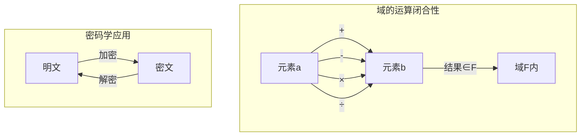
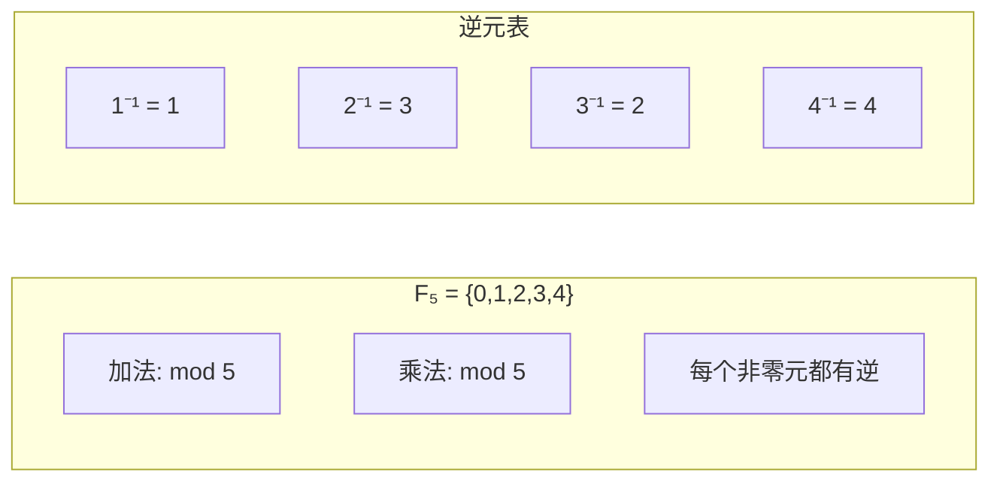
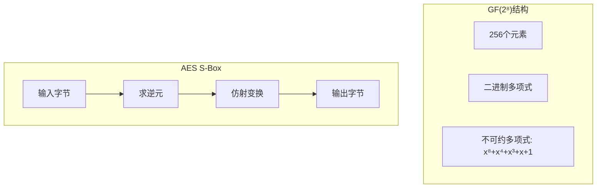
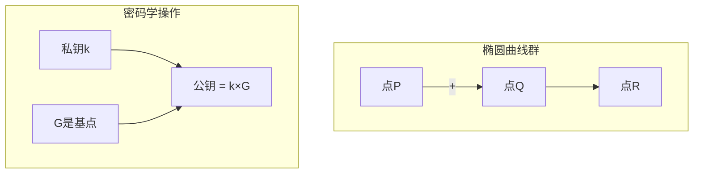
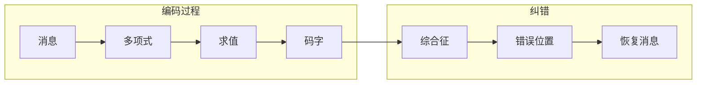
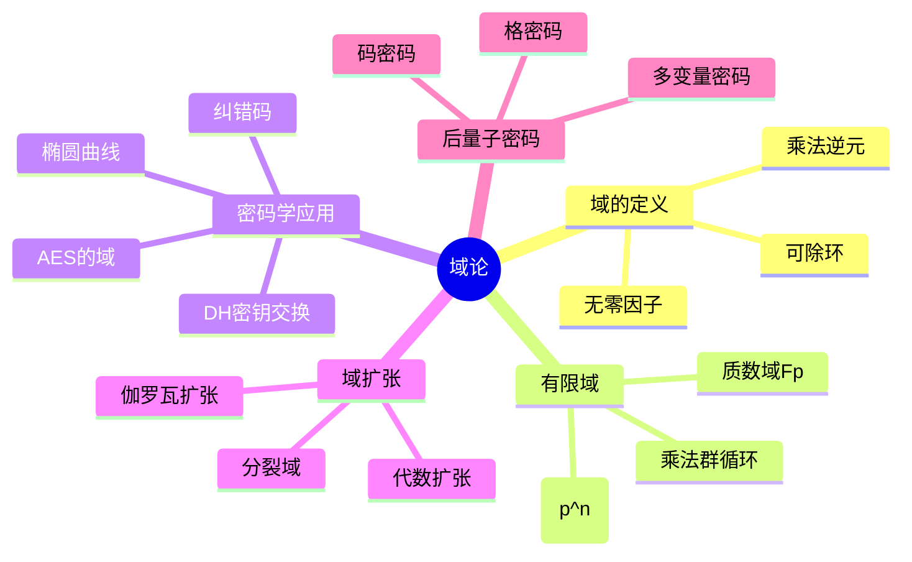

# 🔐 第3章：域的密码花园

> "在域的世界里，每个非零元素都有逆元，这使得密码学成为可能。"

## 🕵️ 开篇故事：密码特工的数学武器

特工艾丽斯需要向总部发送绝密信息。她使用了一种基于"有限域"的加密方法，即使敌人截获了密文，没有密钥也无法破解。这个看似魔法的加密系统，背后是优雅的域论数学！

让我们跟随艾丽斯，揭开现代密码学的数学面纱。

## 🎯 本章目标

学完本章，你将能够：
- ✅ 理解域的定义和性质
- ✅ 掌握有限域的构造方法
- ✅ 实现基于域的加密算法
- ✅ 理解椭圆曲线密码学基础
- ✅ 设计自己的密码系统

## 🌻 3.1 什么是域？

### 🔑 密码学引入

在RSA加密中，我们需要计算：
```
密文 = 明文^e mod n
明文 = 密文^d mod n
```

这里的运算需要在一个特殊的代数结构中进行——**域**！

### 📝 域的定义

一个**域(Field)** (F, +, ·) 是一个环，额外满足：

1. **乘法交换律**：a · b = b · a
2. **乘法单位元**：存在1 ≠ 0，使得 a · 1 = a
3. **乘法逆元**：对所有 a ≠ 0，存在 a⁻¹，使得 a · a⁻¹ = 1

简单说：域 = 可以加减乘除的代数系统！

### 🎨 域的可视化



## 🔢 3.2 有限域：密码学的基石

### 🎲 质数域 Fp

最简单的有限域：**Fp = ℤ/pℤ**（p是质数）



### 🌺 域的扩张：GF(p^n)

```python
class GaloisField:
    """伽罗瓦域 GF(p^n) 的实现"""
    
    def __init__(self, p, n, irreducible_poly):
        self.p = p  # 特征
        self.n = n  # 扩张次数
        self.size = p ** n
        self.irreducible = irreducible_poly
        
    def add(self, a, b):
        """域中的加法"""
        result = []
        for i in range(max(len(a), len(b))):
            coeff_a = a[i] if i < len(a) else 0
            coeff_b = b[i] if i < len(b) else 0
            result.append((coeff_a + coeff_b) % self.p)
        return result
    
    def multiply(self, a, b):
        """域中的乘法（模不可约多项式）"""
        # 多项式乘法
        product = [0] * (len(a) + len(b) - 1)
        for i in range(len(a)):
            for j in range(len(b)):
                product[i + j] = (product[i + j] + 
                                 a[i] * b[j]) % self.p
        
        # 模不可约多项式
        return self._mod_poly(product)
    
    def inverse(self, a):
        """使用扩展欧几里得算法求逆元"""
        # 实现省略，返回 a^(-1)
        pass
```

### 🔐 AES中的域：GF(2⁸)

AES加密使用的域：



## 🔐 3.3 密码学应用

### 🔑 Diffie-Hellman密钥交换

```python
class DiffieHellman:
    """基于有限域的密钥交换"""
    
    def __init__(self, p, g):
        self.p = p  # 大质数
        self.g = g  # 生成元
        
    def generate_private_key(self):
        """生成私钥"""
        from random import randint
        return randint(2, self.p - 2)
    
    def compute_public_key(self, private_key):
        """计算公钥: g^private mod p"""
        return pow(self.g, private_key, self.p)
    
    def compute_shared_secret(self, other_public, my_private):
        """计算共享密钥"""
        return pow(other_public, my_private, self.p)

# 使用示例
dh = DiffieHellman(p=23, g=5)

# Alice
alice_private = dh.generate_private_key()
alice_public = dh.compute_public_key(alice_private)

# Bob  
bob_private = dh.generate_private_key()
bob_public = dh.compute_public_key(bob_private)

# 共享密钥
alice_shared = dh.compute_shared_secret(bob_public, alice_private)
bob_shared = dh.compute_shared_secret(alice_public, bob_private)

assert alice_shared == bob_shared  # 相同的密钥！
```

### 🔐 椭圆曲线密码学

椭圆曲线方程：**y² = x³ + ax + b (mod p)**



```python
class EllipticCurve:
    """有限域上的椭圆曲线"""
    
    def __init__(self, a, b, p):
        self.a = a
        self.b = b
        self.p = p
        # 验证曲线非奇异
        assert (4 * pow(a, 3, p) + 27 * pow(b, 2, p)) % p != 0
        
    def is_on_curve(self, point):
        """检查点是否在曲线上"""
        if point is None:  # 无穷远点
            return True
        x, y = point
        return (y * y - x * x * x - self.a * x - self.b) % self.p == 0
    
    def add_points(self, P, Q):
        """椭圆曲线点加法"""
        if P is None:
            return Q
        if Q is None:
            return P
            
        x1, y1 = P
        x2, y2 = Q
        
        if x1 == x2:
            if y1 == y2:
                # P = Q，点倍乘
                s = (3 * x1 * x1 + self.a) * self._mod_inverse(2 * y1) % self.p
            else:
                # P = -Q
                return None
        else:
            # P ≠ Q
            s = (y2 - y1) * self._mod_inverse(x2 - x1) % self.p
            
        x3 = (s * s - x1 - x2) % self.p
        y3 = (s * (x1 - x3) - y1) % self.p
        
        return (x3, y3)
    
    def scalar_multiply(self, k, P):
        """标量乘法: k×P"""
        if k == 0:
            return None
        if k == 1:
            return P
            
        # 使用double-and-add算法
        result = None
        addend = P
        
        while k:
            if k & 1:
                result = self.add_points(result, addend)
            addend = self.add_points(addend, addend)
            k >>= 1
            
        return result
```

## 🌺 3.4 域的扩张与分裂域

### 📐 代数扩张

```mermaid
graph TD
    subgraph "域扩张塔"
    Q[有理数域 ℚ]
    Q2[ℚ(√2)]
    Q23[ℚ(√2, √3)]
    C[复数域 ℂ]
    
    Q --> Q2
    Q2 --> Q23
    Q23 --> C
    end
```

### 🎯 分裂域的应用

在密码学中，我们常需要找到多项式完全分解的域：

```python
class SplittingField:
    """分裂域的构造"""
    
    def find_roots_in_extension(self, poly, base_field):
        """在域扩张中寻找多项式的根"""
        # 检查是否已经完全分裂
        if self.is_split(poly, base_field):
            return base_field
            
        # 找到一个不可约因子
        irred_factor = self.find_irreducible_factor(poly, base_field)
        
        # 构造扩域
        extension = self.construct_extension(base_field, irred_factor)
        
        # 递归处理
        return self.find_roots_in_extension(poly, extension)
```

## 🔒 3.5 纠错码：域的另一个应用

### 📡 Reed-Solomon码



```python
class ReedSolomon:
    """基于有限域的纠错码"""
    
    def __init__(self, n, k, field):
        self.n = n  # 码长
        self.k = k  # 信息长度
        self.field = field
        self.generator = self._build_generator()
        
    def encode(self, message):
        """编码消息"""
        # 消息多项式
        m_poly = message + [0] * (self.n - self.k)
        
        # 除以生成多项式
        _, remainder = self.field.poly_divmod(m_poly, self.generator)
        
        # 系统码 = 消息 + 校验位
        return message + remainder
    
    def decode(self, received):
        """解码并纠错"""
        # 计算综合征
        syndromes = self._calculate_syndromes(received)
        
        if all(s == 0 for s in syndromes):
            return received[:self.k]  # 无错误
            
        # 错误位置多项式
        error_locator = self._berlekamp_massey(syndromes)
        
        # 找到错误位置
        error_positions = self._find_errors(error_locator)
        
        # 纠正错误
        corrected = self._correct_errors(received, 
                                        error_positions, 
                                        syndromes)
        
        return corrected[:self.k]
```

## 🎮 3.6 实践项目：量子安全密码

### 💻 基于格的密码学

后量子时代的密码学依赖于新的数学难题：

```python
class LatticeCrypto:
    """基于格的加密（简化版）"""
    
    def __init__(self, n, q):
        self.n = n  # 维度
        self.q = q  # 模数（大质数）
        
    def generate_keys(self):
        """生成公私钥对"""
        # 私钥：短向量
        s = self._sample_short_vector()
        
        # 公钥：A·s + e (mod q)
        A = self._random_matrix(self.n, self.n)
        e = self._sample_error_vector()
        b = (A @ s + e) % self.q
        
        public_key = (A, b)
        private_key = s
        
        return public_key, private_key
    
    def encrypt(self, message, public_key):
        """加密消息"""
        A, b = public_key
        
        # 随机向量
        r = self._sample_binary_vector()
        
        # 密文 = (A^T·r, b^T·r + message)
        c1 = (A.T @ r) % self.q
        c2 = (b.T @ r + message * (self.q // 2)) % self.q
        
        return (c1, c2)
    
    def decrypt(self, ciphertext, private_key):
        """解密消息"""
        c1, c2 = ciphertext
        s = private_key
        
        # 计算 c2 - c1^T·s
        v = (c2 - c1.T @ s) % self.q
        
        # 舍入恢复消息
        return 1 if v > self.q // 4 else 0
```

## 🎯 3.7 本章小结

### 核心概念思维导图



### 🏆 成就解锁

完成本章学习后，你已经：
- 🎖️ **域论专家**：掌握域的核心理论
- 🎖️ **密码学家**：理解现代密码学基础
- 🎖️ **椭圆曲线大师**：实现ECC算法
- 🎖️ **量子安全卫士**：了解后量子密码学

## 📝 3.8 练习与挑战

### 🌟 基础练习

1. 证明：F_p中每个非零元素的阶整除p-1
2. 构造GF(16)的加法和乘法表
3. 实现椭圆曲线点加法
4. 编写简单的Reed-Solomon编解码器

### 🚀 进阶挑战

1. **破解简单密码**
   - 实现小域上的离散对数攻击
   - 分析为什么需要大素数
   
2. **椭圆曲线密码系统**
   - 实现完整的ECDH协议
   - 设计数字签名方案
   
3. **量子安全评估**
   - 比较不同后量子算法
   - 实现简化版格密码

### 💡 思考题

> "如果量子计算机真的出现，基于哪些数学难题的密码系统会失效？哪些会幸存？"

## 🎬 下一章预告

掌握了域的概念，我们即将进入线性代数与抽象代数的交汇点——**向量空间**。在那里，我们会发现向量不仅仅是箭头，而是域上的优雅结构。准备好探索高维空间的奥秘了吗？

让我们一起走进[第4章：向量空间的几何冒险](chapter4-vector-spaces.md)！

---

*"密码学是应用数学的艺术，而域论是这门艺术的画布。" - 保护信息，守护隐私！*