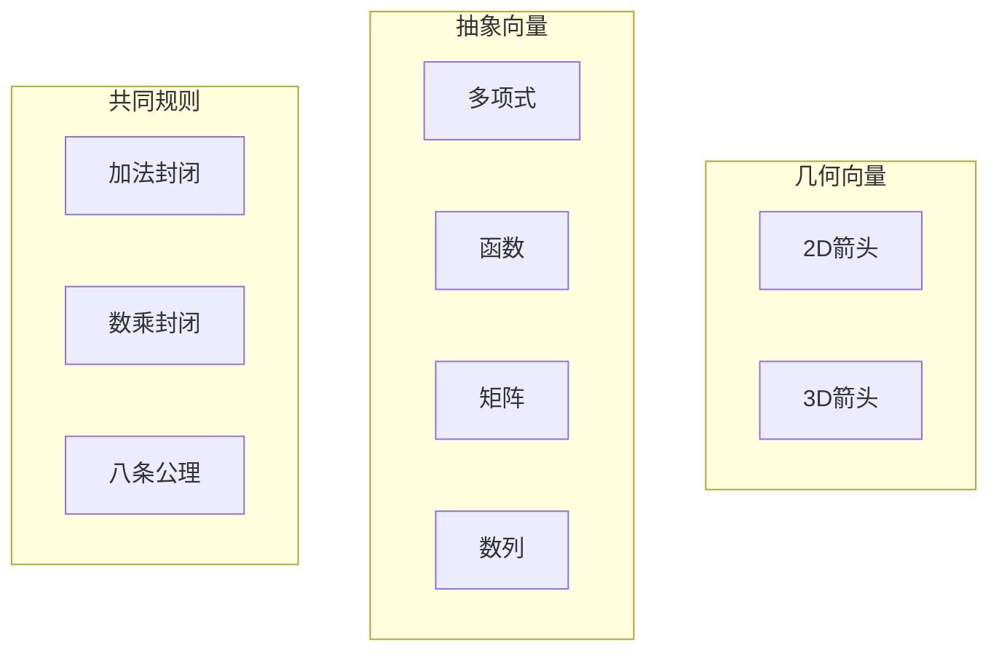
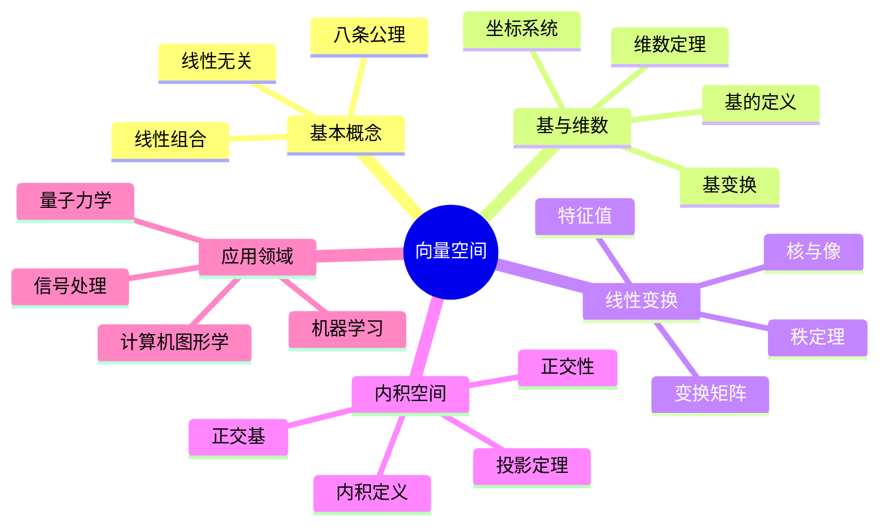

# 🌌 第4章：向量空间的几何冒险

> "向量空间是线性代数与抽象代数的美妙交响曲。"

## 🚀 开篇故事：星际导航的数学

2350年，星际探险家凯拉驾驶飞船在四维空间中航行。她发现，要在高维空间中定位和导航，需要的不仅是坐标，更需要理解空间的代数结构。向量空间理论成了她最重要的导航工具！

让我们跟随凯拉，探索向量空间的奇妙世界。

## 🎯 本章目标

学完本章，你将能够：
- ✅ 理解向量空间的抽象定义
- ✅ 掌握基、维数和坐标的概念
- ✅ 理解线性变换的本质
- ✅ 探索内积空间和正交性
- ✅ 实现计算机图形学应用

## 🌟 4.1 向量空间：不只是箭头

### 🎨 从几何到代数

传统观念：向量 = 有方向的箭头
抽象观念：向量 = 满足特定规则的元素



### 📝 向量空间的定义

域F上的**向量空间**V需要满足：

#### 加法公理：
1. **封闭性**：u + v ∈ V
2. **交换律**：u + v = v + u
3. **结合律**：(u + v) + w = u + (v + w)
4. **零向量**：存在0，使得v + 0 = v
5. **负向量**：存在-v，使得v + (-v) = 0

#### 数乘公理：
6. **封闭性**：cv ∈ V (c ∈ F)
7. **分配律1**：c(u + v) = cu + cv
8. **分配律2**：(c + d)v = cv + dv
9. **结合律**：(cd)v = c(dv)
10. **单位元**：1v = v

### 🌈 向量空间的例子

```python
class VectorSpaceExamples:
    """各种向量空间的例子"""
    
    @staticmethod
    def euclidean_space(n):
        """欧几里得空间 R^n"""
        class RnVector:
            def __init__(self, components):
                self.components = components
                
            def __add__(self, other):
                return RnVector([a + b for a, b in 
                               zip(self.components, other.components)])
                               
            def __mul__(self, scalar):
                return RnVector([scalar * c for c in self.components])
                
        return RnVector
    
    @staticmethod
    def polynomial_space(max_degree):
        """次数不超过n的多项式空间"""
        class Polynomial:
            def __init__(self, coeffs):
                self.coeffs = coeffs[:max_degree + 1]
                
            def __add__(self, other):
                result = []
                for i in range(max(len(self.coeffs), len(other.coeffs))):
                    a = self.coeffs[i] if i < len(self.coeffs) else 0
                    b = other.coeffs[i] if i < len(other.coeffs) else 0
                    result.append(a + b)
                return Polynomial(result)
                
        return Polynomial
    
    @staticmethod
    def function_space(domain):
        """函数空间 F(domain, R)"""
        class Function:
            def __init__(self, f):
                self.f = f
                
            def __add__(self, other):
                return Function(lambda x: self.f(x) + other.f(x))
                
            def __mul__(self, scalar):
                return Function(lambda x: scalar * self.f(x))
                
        return Function
```

## 🏗️ 4.2 基与维数：空间的骨架

### 🎯 线性组合与张成

```mermaid
graph TD
    subgraph "线性组合"
    V1[v₁] -->|c₁| LC[c₁v₁ + c₂v₂ + ... + cₙvₙ]
    V2[v₂] -->|c₂| LC
    Vn[vₙ] -->|cₙ| LC
    end
    
    subgraph "张成空间"
    S[向量集S]
    SP[span(S) = 所有线性组合]
    S --> SP
    end
```

### 🔑 基的概念

向量集合B是V的**基**，如果：
1. B线性无关
2. span(B) = V

```python
class VectorSpace:
    """向量空间的基本操作"""
    
    def is_linearly_independent(self, vectors):
        """判断向量组是否线性无关"""
        # 构造矩阵
        matrix = self._vectors_to_matrix(vectors)
        
        # 计算秩
        rank = self._compute_rank(matrix)
        
        return rank == len(vectors)
    
    def find_basis(self, vectors):
        """从向量组中提取基"""
        basis = []
        
        for v in vectors:
            # 尝试添加向量
            candidate = basis + [v]
            
            if self.is_linearly_independent(candidate):
                basis.append(v)
                
        return basis
    
    def dimension(self, basis):
        """计算维数"""
        return len(basis)
    
    def coordinates(self, vector, basis):
        """计算向量在给定基下的坐标"""
        # 解线性方程组
        # vector = c₁b₁ + c₂b₂ + ... + cₙbₙ
        matrix = self._vectors_to_matrix(basis)
        coords = self._solve_linear_system(matrix, vector)
        
        return coords
```

### 🌈 基变换

```mermaid
graph LR
    subgraph "旧基B"
    B1[b₁, b₂, ..., bₙ]
    end
    
    subgraph "新基B'"
    B2[b'₁, b'₂, ..., b'ₙ]
    end
    
    subgraph "变换矩阵"
    P[P = [b'₁]ᴮ [b'₂]ᴮ ... [b'ₙ]ᴮ]
    end
    
    B1 -->|P| B2
    
    subgraph "坐标变换"
    X1[xᴮ] -->|P⁻¹| X2[xᴮ']
    end
```

## 🔄 4.3 线性变换：空间的变形术

### 📐 线性变换的定义

T: V → W 是**线性变换**，如果：
1. T(u + v) = T(u) + T(v)
2. T(cv) = cT(v)

### 🎨 可视化线性变换

```python
import numpy as np
import matplotlib.pyplot as plt

class LinearTransformVisualizer:
    """线性变换可视化工具"""
    
    def __init__(self):
        self.fig, (self.ax1, self.ax2) = plt.subplots(1, 2, figsize=(12, 6))
        
    def show_transform(self, matrix, title="线性变换"):
        """显示2D线性变换效果"""
        # 创建网格
        x = np.linspace(-5, 5, 20)
        y = np.linspace(-5, 5, 20)
        X, Y = np.meshgrid(x, y)
        
        # 原始网格点
        points = np.vstack([X.ravel(), Y.ravel()])
        
        # 变换后的点
        transformed = matrix @ points
        
        # 绘制原始网格
        self.ax1.scatter(points[0], points[1], c='blue', alpha=0.5)
        self.ax1.set_title("原始空间")
        self.ax1.grid(True)
        
        # 绘制变换后网格
        self.ax2.scatter(transformed[0], transformed[1], c='red', alpha=0.5)
        self.ax2.set_title(f"变换后: {title}")
        self.ax2.grid(True)
        
        # 特别标注基向量
        self._draw_basis_vectors(self.ax1, np.eye(2), 'blue')
        self._draw_basis_vectors(self.ax2, matrix, 'red')
        
    def _draw_basis_vectors(self, ax, matrix, color):
        """绘制基向量"""
        origin = [0, 0]
        e1 = matrix[:, 0]
        e2 = matrix[:, 1]
        
        ax.quiver(*origin, *e1, color=color, scale=1, scale_units='xy', 
                  angles='xy', width=0.01)
        ax.quiver(*origin, *e2, color=color, scale=1, scale_units='xy', 
                  angles='xy', width=0.01)
```

### 🎮 常见的线性变换

```python
class CommonTransforms:
    """常见的线性变换"""
    
    @staticmethod
    def rotation(theta):
        """旋转变换"""
        return np.array([
            [np.cos(theta), -np.sin(theta)],
            [np.sin(theta), np.cos(theta)]
        ])
    
    @staticmethod
    def scaling(sx, sy):
        """缩放变换"""
        return np.array([
            [sx, 0],
            [0, sy]
        ])
    
    @staticmethod
    def shear(kx, ky):
        """剪切变换"""
        return np.array([
            [1, kx],
            [ky, 1]
        ])
    
    @staticmethod
    def reflection(axis='x'):
        """反射变换"""
        if axis == 'x':
            return np.array([[1, 0], [0, -1]])
        elif axis == 'y':
            return np.array([[-1, 0], [0, 1]])
        else:  # 关于y=x反射
            return np.array([[0, 1], [1, 0]])
    
    @staticmethod
    def projection(onto_vector):
        """投影变换"""
        v = np.array(onto_vector)
        v = v / np.linalg.norm(v)  # 归一化
        return np.outer(v, v)
```

## 🌠 4.4 内积空间：几何的回归

### 📏 内积的定义

内积空间是带有内积 ⟨·,·⟩ 的向量空间，满足：
1. **共轭对称**：⟨u,v⟩ = ⟨v,u⟩*
2. **线性**：⟨au+bv,w⟩ = a⟨u,w⟩ + b⟨v,w⟩
3. **正定性**：⟨v,v⟩ ≥ 0，且 ⟨v,v⟩ = 0 ⟺ v = 0

### 🎯 正交性与投影

```mermaid
graph TD
    subgraph "正交投影"
    V[向量v]
    U[子空间U]
    P[proj_U(v)]
    O[v - proj_U(v) ⊥ U]
    
    V --> P
    V --> O
    P --> U
    end
```

```python
class InnerProductSpace:
    """内积空间操作"""
    
    def __init__(self, inner_product):
        self.inner_product = inner_product
        
    def norm(self, v):
        """范数"""
        return np.sqrt(self.inner_product(v, v))
    
    def normalize(self, v):
        """归一化"""
        return v / self.norm(v)
    
    def angle(self, u, v):
        """两向量夹角"""
        cos_theta = self.inner_product(u, v) / (self.norm(u) * self.norm(v))
        return np.arccos(np.clip(cos_theta, -1, 1))
    
    def gram_schmidt(self, vectors):
        """Gram-Schmidt正交化"""
        orthogonal = []
        
        for v in vectors:
            # 减去在已有正交向量上的投影
            u = v.copy()
            for ui in orthogonal:
                proj = self.inner_product(v, ui) / self.inner_product(ui, ui)
                u = u - proj * ui
                
            if self.norm(u) > 1e-10:  # 非零向量
                orthogonal.append(self.normalize(u))
                
        return orthogonal
    
    def projection(self, v, subspace_basis):
        """向子空间投影"""
        proj = np.zeros_like(v)
        
        for basis_vector in subspace_basis:
            coeff = self.inner_product(v, basis_vector)
            proj += coeff * basis_vector
            
        return proj
```

### 🌈 函数空间的内积

```python
class FunctionInnerProduct:
    """函数空间的内积"""
    
    def __init__(self, domain, weight=None):
        self.domain = domain
        self.weight = weight or (lambda x: 1)
        
    def __call__(self, f, g):
        """计算内积 ⟨f,g⟩ = ∫f(x)g(x)w(x)dx"""
        from scipy import integrate
        
        def integrand(x):
            return f(x) * g(x) * self.weight(x)
            
        result, _ = integrate.quad(integrand, *self.domain)
        return result
    
    def orthogonal_polynomials(self, n):
        """生成前n个正交多项式"""
        polys = []
        
        for i in range(n):
            # 从x^i开始
            p = lambda x, i=i: x**i
            
            # Gram-Schmidt正交化
            for prev in polys:
                proj = self(p, prev) / self(prev, prev)
                p = lambda x, p=p, prev=prev, proj=proj: p(x) - proj * prev(x)
                
            # 归一化
            norm = np.sqrt(self(p, p))
            p = lambda x, p=p, norm=norm: p(x) / norm
            
            polys.append(p)
            
        return polys
```

## 🎮 4.5 实践项目：3D图形引擎

### 💻 基于向量空间的3D渲染

```python
class Simple3DEngine:
    """简单的3D图形引擎"""
    
    def __init__(self, width=800, height=600):
        self.width = width
        self.height = height
        self.camera = Camera()
        self.objects = []
        
    def add_object(self, vertices, faces):
        """添加3D物体"""
        self.objects.append({
            'vertices': np.array(vertices),
            'faces': faces
        })
        
    def render(self):
        """渲染场景"""
        screen = np.zeros((self.height, self.width, 3))
        
        for obj in self.objects:
            # 模型变换
            world_vertices = self.transform_to_world(obj['vertices'])
            
            # 视图变换
            view_vertices = self.camera.view_transform(world_vertices)
            
            # 投影变换
            screen_vertices = self.perspective_projection(view_vertices)
            
            # 光栅化
            self.rasterize(screen, screen_vertices, obj['faces'])
            
        return screen
    
    def transform_to_world(self, vertices, 
                          translation=(0,0,0), 
                          rotation=(0,0,0), 
                          scale=(1,1,1)):
        """世界坐标变换"""
        # 构造变换矩阵
        T = self.translation_matrix(*translation)
        R = self.rotation_matrix(*rotation)
        S = self.scaling_matrix(*scale)
        
        # 组合变换
        M = T @ R @ S
        
        # 齐次坐标
        homo_vertices = np.hstack([vertices, np.ones((len(vertices), 1))])
        transformed = (M @ homo_vertices.T).T
        
        return transformed[:, :3]
    
    def perspective_projection(self, vertices, fov=60, near=0.1, far=100):
        """透视投影"""
        aspect = self.width / self.height
        f = 1 / np.tan(np.radians(fov) / 2)
        
        # 投影矩阵
        P = np.array([
            [f/aspect, 0, 0, 0],
            [0, f, 0, 0],
            [0, 0, (far+near)/(near-far), 2*far*near/(near-far)],
            [0, 0, -1, 0]
        ])
        
        # 应用投影
        homo_vertices = np.hstack([vertices, np.ones((len(vertices), 1))])
        projected = (P @ homo_vertices.T).T
        
        # 透视除法
        projected = projected[:, :3] / projected[:, 3:4]
        
        # 视口变换
        projected[:, 0] = (projected[:, 0] + 1) * self.width / 2
        projected[:, 1] = (projected[:, 1] + 1) * self.height / 2
        
        return projected
```

### 🌟 向量空间在机器学习中的应用

```python
class VectorSpaceML:
    """向量空间在机器学习中的应用"""
    
    def pca(self, data, n_components):
        """主成分分析"""
        # 中心化
        mean = np.mean(data, axis=0)
        centered = data - mean
        
        # 协方差矩阵
        cov = centered.T @ centered / len(data)
        
        # 特征分解
        eigenvalues, eigenvectors = np.linalg.eigh(cov)
        
        # 选择主成分
        idx = eigenvalues.argsort()[::-1][:n_components]
        components = eigenvectors[:, idx]
        
        # 投影
        transformed = centered @ components
        
        return transformed, components
    
    def kernel_pca(self, data, kernel_func, n_components):
        """核主成分分析"""
        n = len(data)
        
        # 核矩阵
        K = np.zeros((n, n))
        for i in range(n):
            for j in range(n):
                K[i, j] = kernel_func(data[i], data[j])
                
        # 中心化核矩阵
        one_n = np.ones((n, n)) / n
        K_centered = K - one_n @ K - K @ one_n + one_n @ K @ one_n
        
        # 特征分解
        eigenvalues, eigenvectors = np.linalg.eigh(K_centered)
        
        # 选择主成分
        idx = eigenvalues.argsort()[::-1][:n_components]
        alphas = eigenvectors[:, idx]
        lambdas = eigenvalues[idx]
        
        # 归一化
        alphas = alphas / np.sqrt(lambdas)
        
        return alphas
```

## 🎯 4.6 本章小结

### 核心概念思维导图



### 🏆 成就解锁

完成本章学习后，你已经：
- 🎖️ **空间探索者**：理解抽象向量空间
- 🎖️ **基底建筑师**：掌握基与坐标系
- 🎖️ **变换大师**：精通线性变换
- 🎖️ **几何学家**：理解内积空间的几何

## 📝 4.7 练习与挑战

### 🌟 基础练习

1. 证明：多项式空间P_n是(n+1)维的
2. 找出R^3到R^2的投影变换矩阵
3. 实现Gram-Schmidt正交化算法
4. 证明：正交矩阵保持内积不变

### 🚀 进阶挑战

1. **量子态空间**
   - 构造量子比特的向量空间
   - 实现量子门操作
   
2. **傅里叶分析**
   - 理解函数空间的正交基
   - 实现离散傅里叶变换
   
3. **计算机视觉**
   - 实现相机标定算法
   - 设计图像变换效果

### 💡 思考题

> "如果把人类的所有知识看作一个向量空间，什么是这个空间的'基'？如何定义知识之间的'内积'？"

## 🎬 下一章预告

我们即将迎来近世代数的巅峰——**伽罗瓦理论**！这是一个充满传奇色彩的理论，它不仅解决了古老的方程求解问题，更展现了对称性与可解性之间的深刻联系。准备好了解这位数学天才的革命性思想了吗？

让我们一起走进[第5章：伽罗瓦的革命](chapter5-galois-theory.md)！

---

*"向量空间是现代数学的语言，而我们都是这种语言的诗人。" - 在抽象中发现美！*