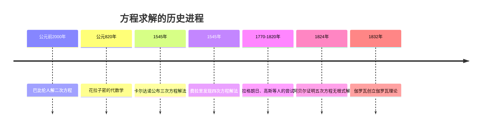
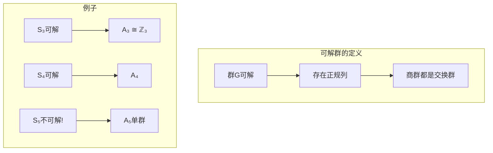
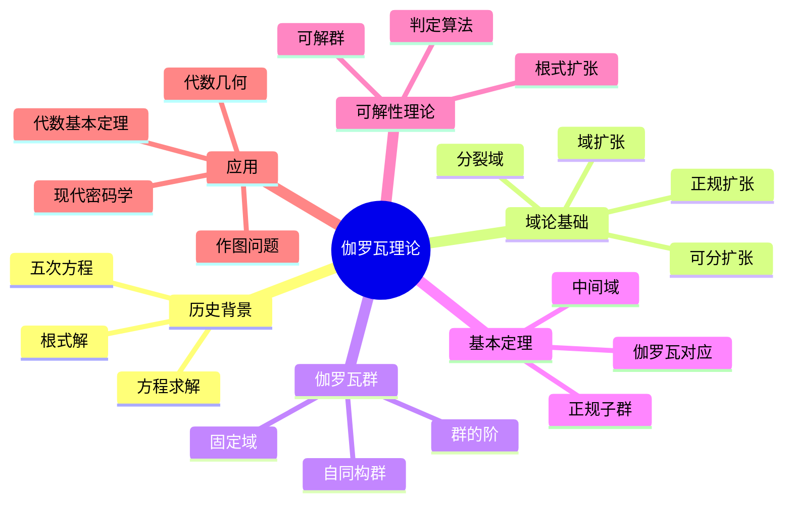

# ⚔️ 第5章：伽罗瓦的革命 - 方程求解的史诗

> "伽罗瓦不仅解决了一个问题，他创造了一种全新的数学思维方式。"

## 🗡️ 开篇故事：决斗前夜的数学遗产

1832年5月30日深夜，20岁的埃瓦里斯特·伽罗瓦知道明天的决斗可能让他丧命。在烛光下，他疯狂地写下了自己的数学思想："没有时间了！"他在手稿边缘潦草地写道。

这一夜，他留下的不仅是解决五次方程的方法，更是连接方程可解性与群论的革命性理论。让我们走进这位数学天才的思想世界！

## 🎯 本章目标

学完本章，你将能够：
- ✅ 理解域扩张与多项式的关系
- ✅ 掌握伽罗瓦群的概念
- ✅ 理解伽罗瓦基本定理
- ✅ 判断方程的根式可解性
- ✅ 欣赏对称性与可解性的深刻联系

## 📜 5.1 千年难题：方程求解的历史

### 🏛️ 从古巴比伦到文艺复兴



### 🔍 核心问题

**什么样的方程可以用根式求解？**

根式解 = 只用加减乘除和开方根表达的解

```python
class PolynomialSolver:
    """多项式方程求解器"""
    
    def quadratic_formula(self, a, b, c):
        """二次方程 ax² + bx + c = 0"""
        discriminant = b**2 - 4*a*c
        if discriminant >= 0:
            x1 = (-b + discriminant**0.5) / (2*a)
            x2 = (-b - discriminant**0.5) / (2*a)
            return x1, x2
        else:
            # 复数根
            real = -b / (2*a)
            imag = (-discriminant)**0.5 / (2*a)
            return complex(real, imag), complex(real, -imag)
    
    def cubic_formula(self, a, b, c, d):
        """三次方程 ax³ + bx² + cx + d = 0 (卡尔达诺公式)"""
        # 标准化
        b, c, d = b/a, c/a, d/a
        
        # 消去二次项
        p = c - b**2/3
        q = 2*b**3/27 - b*c/3 + d
        
        # 判别式
        discriminant = -(4*p**3 + 27*q**2) / 108
        
        # 求解（简化版本）
        # 实际的卡尔达诺公式相当复杂...
        pass
```

## 🌱 5.2 域扩张：构建解的家园

### 🏗️ 扩张的概念

```mermaid
graph TD
    subgraph "域扩张链"
    Q[有理数域 ℚ]
    Q2[ℚ(√2)]
    Q23[ℚ(√2, √3)]
    Q23i[ℚ(√2, √3, i)]
    
    Q --> Q2
    Q2 --> Q23
    Q23 --> Q23i
    end
    
    subgraph "扩张类型"
    A[代数扩张]
    T[超越扩张]
    S[单扩张]
    F[有限扩张]
    end
```

### 📐 分裂域

多项式f(x)的**分裂域**是包含f(x)所有根的最小域。

```python
class FieldExtension:
    """域扩张的实现"""
    
    def __init__(self, base_field, element, minimal_poly):
        self.base = base_field
        self.generator = element  # α
        self.minimal_poly = minimal_poly  # α的最小多项式
        self.degree = len(minimal_poly) - 1
        
    def contains(self, element):
        """判断元素是否在扩域中"""
        # element = a₀ + a₁α + ... + aₙ₋₁αⁿ⁻¹
        return isinstance(element, self.FieldElement)
    
    class FieldElement:
        """扩域中的元素"""
        def __init__(self, coefficients):
            self.coeffs = coefficients
            
        def __add__(self, other):
            """域中加法"""
            result = []
            for i in range(max(len(self.coeffs), len(other.coeffs))):
                a = self.coeffs[i] if i < len(self.coeffs) else 0
                b = other.coeffs[i] if i < len(other.coeffs) else 0
                result.append(a + b)
            return FieldElement(result)
        
        def __mul__(self, other):
            """域中乘法（需要模最小多项式）"""
            # 多项式乘法后模minimal_poly
            pass
```

### 🌟 根式扩张

```mermaid
graph LR
    subgraph "根式塔"
    F0[F₀] --> F1[F₁ = F₀(∜a₁)]
    F1 --> F2[F₂ = F₁(∜a₂)]
    F2 --> F3[F₃ = F₂(∜a₃)]
    F3 --> Fn[Fₙ]
    end
    
    subgraph "可解条件"
    R[方程可解] -.-> T[存在根式塔]
    T -.-> G[伽罗瓦群可解]
    end
```

## 🎭 5.3 伽罗瓦群：对称性的代数

### 🔄 自同构与伽罗瓦群

**伽罗瓦群** Gal(E/F) = E的所有保持F不变的自同构

```python
class GaloisGroup:
    """伽罗瓦群的计算"""
    
    def __init__(self, extension, base_field):
        self.extension = extension
        self.base = base_field
        self.automorphisms = self._find_automorphisms()
        
    def _find_automorphisms(self):
        """找出所有自同构"""
        autos = []
        
        # 对于每个可能的根的置换
        roots = self.extension.polynomial_roots()
        for perm in self._permutations(roots):
            if self._is_automorphism(perm):
                autos.append(perm)
                
        return autos
    
    def _is_automorphism(self, permutation):
        """检验是否为自同构"""
        # 1. 保持基域不变
        # 2. 保持域运算
        # 3. 是双射
        pass
    
    def order(self):
        """群的阶"""
        return len(self.automorphisms)
    
    def is_abelian(self):
        """是否为交换群"""
        for a in self.automorphisms:
            for b in self.automorphisms:
                if self._compose(a, b) != self._compose(b, a):
                    return False
        return True
    
    def is_solvable(self):
        """是否为可解群"""
        # 检查是否存在合成列：
        # G = G₀ ⊃ G₁ ⊃ ... ⊃ Gₙ = {e}
        # 其中每个Gᵢ₊₁都是Gᵢ的正规子群
        # 且Gᵢ/Gᵢ₊₁是交换群
        pass
```

### 🎯 具体例子

```mermaid
graph TD
    subgraph "x²-2的伽罗瓦群"
    Q[ℚ]
    E[ℚ(√2)]
    
    id[恒等: √2 → √2]
    conj[共轭: √2 → -√2]
    
    Q --> E
    E --> id
    E --> conj
    end
    
    subgraph "群结构"
    G[Gal(ℚ(√2)/ℚ) ≅ ℤ₂]
    end
```

## 🌈 5.4 伽罗瓦基本定理

### 📊 对应关系

```mermaid
graph LR
    subgraph "域的格"
    E[扩域E]
    M1[中间域M₁]
    M2[中间域M₂]
    F[基域F]
    
    E --> M1
    E --> M2
    M1 --> F
    M2 --> F
    end
    
    subgraph "子群格"
    e[{e}]
    H1[子群H₁]
    H2[子群H₂]
    G[Gal(E/F)]
    
    e --> H1
    e --> H2
    H1 --> G
    H2 --> G
    end
    
    E -.-> e
    M1 -.-> H1
    M2 -.-> H2
    F -.-> G
```

### 🎪 基本定理

**伽罗瓦基本定理**：E/F的中间域与Gal(E/F)的子群之间存在一一对应！

```python
class GaloisCorrespondence:
    """伽罗瓦对应的实现"""
    
    def __init__(self, extension, base_field):
        self.E = extension
        self.F = base_field
        self.G = GaloisGroup(extension, base_field)
        
    def fixed_field(self, subgroup):
        """子群的不动域"""
        field = self.E.copy()
        
        # 找出被子群所有元素固定的元素
        fixed_elements = []
        for element in self.E:
            if all(auto(element) == element for auto in subgroup):
                fixed_elements.append(element)
                
        return Field(fixed_elements)
    
    def fixing_group(self, intermediate_field):
        """中间域的固定子群"""
        subgroup = []
        
        for auto in self.G.automorphisms:
            if all(auto(x) == x for x in intermediate_field):
                subgroup.append(auto)
                
        return subgroup
    
    def verify_correspondence(self):
        """验证对应关系"""
        # 1. 对每个子群H，H = Gal(E/E^H)
        # 2. 对每个中间域K，K = E^{Gal(E/K)}
        # 3. |H| · [E^H : F] = [E : F]
        pass
```

## ⚔️ 5.5 可解性判定

### 🎲 可解群的判定



### 🔮 方程可解性判定器

```python
class SolvabilityChecker:
    """方程可解性判定"""
    
    def is_solvable_by_radicals(self, polynomial):
        """判断多项式是否可用根式求解"""
        # 1. 计算分裂域
        splitting_field = self.compute_splitting_field(polynomial)
        
        # 2. 计算伽罗瓦群
        galois_group = GaloisGroup(splitting_field, polynomial.base_field)
        
        # 3. 判断伽罗瓦群是否可解
        return galois_group.is_solvable()
    
    def general_polynomial_galois_group(self, degree):
        """一般n次多项式的伽罗瓦群"""
        if degree <= 4:
            return f"S_{degree} (可解)"
        else:
            return f"S_{degree} (不可解!)"
    
    def specific_examples(self):
        """具体例子"""
        examples = {
            "x² - 2": "Gal = ℤ₂ (可解)",
            "x³ - 2": "Gal = S₃ (可解)",
            "x⁴ + x + 1": "Gal = S₄ (可解)",
            "x⁵ - x - 1": "Gal = S₅ (不可解!)",
            "x⁵ - 2": "Gal = F₂₀ (可解，特殊情况)"
        }
        return examples
```

## 🎨 5.6 伽罗瓦理论的应用

### 📐 古典作图问题

```python
class ClassicalConstructions:
    """古典作图问题的解答"""
    
    def is_constructible(self, number):
        """判断数是否可作图"""
        # 可作图 ⟺ 在某个2次扩张塔中
        # ⟺ [ℚ(number) : ℚ] = 2ⁿ
        
        degree = self.field_degree(number)
        return degree > 0 and (degree & (degree - 1)) == 0  # 是2的幂
    
    def trisect_angle(self, angle):
        """三等分角"""
        # cos(θ/3)满足: 4x³ - 3x - cos(θ) = 0
        # 一般情况下，[ℚ(cos(θ/3)) : ℚ] = 3
        # 3不是2的幂，所以不可作图
        return False
    
    def double_cube(self):
        """倍立方体"""
        # 需要作出∛2
        # [ℚ(∛2) : ℚ] = 3
        return False
    
    def square_circle(self):
        """化圆为方"""
        # 需要作出√π
        # π是超越数，[ℚ(π) : ℚ] = ∞
        return False
    
    def regular_polygon(self, n):
        """正n边形"""
        # 可作图 ⟺ n = 2ᵏ × p₁ × p₂ × ... × pᵣ
        # 其中pᵢ是不同的费马质数
        fermat_primes = [3, 5, 17, 257, 65537]
        # 分解n，检查条件...
        pass
```

### 🌟 代数基本定理的证明

```python
class FundamentalTheoremOfAlgebra:
    """代数基本定理的伽罗瓦证明"""
    
    def proof_sketch(self):
        """证明概要"""
        steps = [
            "1. 设f(x)是ℝ上的非常数多项式",
            "2. 考虑f(x)在ℂ上的分裂域E",
            "3. Gal(E/ℝ)的阶是2的幂（Sylow定理）",
            "4. 存在子群H使得[G:H] = 2",
            "5. E^H是ℝ的二次扩张",
            "6. ℝ的唯一二次扩张是ℂ",
            "7. 因此E ⊆ ℂ",
            "8. 所以f(x)在ℂ中有根"
        ]
        return steps
```

### 🎭 现代应用

```python
class ModernApplications:
    """伽罗瓦理论的现代应用"""
    
    def error_correcting_codes(self):
        """纠错码"""
        # BCH码和Reed-Solomon码使用伽罗瓦域
        pass
    
    def cryptography(self):
        """密码学"""
        # 椭圆曲线密码学基于伽罗瓦域上的群
        pass
    
    def algebraic_number_theory(self):
        """代数数论"""
        # 类域论是伽罗瓦理论的推广
        pass
    
    def algebraic_geometry(self):
        """代数几何"""
        # 基本群是伽罗瓦群的几何类比
        pass
```

## 🎮 5.7 实践项目：伽罗瓦计算器

```python
class GaloisCalculator:
    """交互式伽罗瓦理论计算器"""
    
    def __init__(self):
        self.history = []
        
    def analyze_polynomial(self, poly_str):
        """分析多项式的完整伽罗瓦信息"""
        poly = self.parse_polynomial(poly_str)
        
        results = {
            "多项式": poly_str,
            "次数": poly.degree(),
            "判别式": self.discriminant(poly),
            "不可约性": self.is_irreducible(poly),
            "分裂域": self.splitting_field_info(poly),
            "伽罗瓦群": self.galois_group_info(poly),
            "可解性": self.solvability_info(poly),
            "根的表达式": self.root_expressions(poly) if poly.degree() <= 4 else "次数太高"
        }
        
        return results
    
    def interactive_mode(self):
        """交互式探索模式"""
        print("伽罗瓦理论计算器 v1.0")
        print("输入多项式（如: x^5 - 2）或 'quit' 退出")
        
        while True:
            poly_str = input("\n> ")
            if poly_str.lower() == 'quit':
                break
                
            try:
                results = self.analyze_polynomial(poly_str)
                self.display_results(results)
                self.history.append(results)
            except Exception as e:
                print(f"错误: {e}")
    
    def visualize_galois_correspondence(self, poly):
        """可视化伽罗瓦对应"""
        # 生成中间域和子群的对应图
        pass
```

## 🎯 5.8 本章小结

### 核心概念思维导图



### 🏆 成就解锁

完成本章学习后，你已经：
- 🎖️ **方程猎手**：理解方程可解性的本质
- 🎖️ **对称大师**：掌握伽罗瓦群理论
- 🎖️ **理论家**：理解伽罗瓦基本定理
- 🎖️ **问题终结者**：解决千年数学难题

## 📝 5.9 练习与挑战

### 🌟 基础练习

1. 计算x³-2在ℚ上的伽罗瓦群
2. 证明：S₃是可解群
3. 找出ℚ(√2, √3)的所有中间域
4. 证明：正17边形可以尺规作图

### 🚀 进阶挑战

1. **设计方程**
   - 构造一个伽罗瓦群恰好是A₄的多项式
   - 找出最简单的不可解五次方程
   
2. **计算机代数**
   - 实现分裂域的自动计算
   - 编写伽罗瓦群计算算法
   
3. **理论拓展**
   - 研究无限伽罗瓦扩张
   - 探索微分伽罗瓦理论

### 💡 思考题

> "如果伽罗瓦没有在决斗中丧生，数学会有怎样的发展？他还会创造出什么样的理论？"

## 🎬 尾声

伽罗瓦理论不仅解决了方程求解的千年难题，更重要的是，它展示了一种全新的数学思维方式：通过研究对称性来理解结构。这种思想深刻影响了现代数学的各个分支。

正如伽罗瓦在他生命的最后一夜所写："我没有时间了。"但他留下的理论，却拥有永恒的生命力。

---

*"在数学的历史上，很少有理论能像伽罗瓦理论那样，如此优雅地连接看似无关的领域。" - 向伟大的数学革命致敬！*

## 🚀 继续你的代数之旅

恭喜你完成了近世代数的主要章节！但学习之旅还在继续：

- 📚 [概念速查手册](../resources/quick-reference.md) - 快速复习重要概念
- 🧩 [练习题集](../exercises/problem-set.md) - 挑战更多问题
- 🌟 [进阶主题](../resources/advanced-topics.md) - 探索范畴论、同调代数等

代数的世界无限广阔，愿你在这个美妙的数学宇宙中继续探索！