# 第1章：向量的奇妙世界 🚀

## 📖 开篇故事：迷路的小明

想象一下，小明在一个陌生的城市迷路了。他打开手机导航，屏幕上显示："向东走300米，然后向北走400米。"这个简单的导航指令，其实就是向量的完美体现！

向量不仅告诉我们"走多远"（大小），还告诉我们"往哪走"（方向）。这就是向量的魅力所在——它是有方向的量！

## 🎯 核心概念

### 1. 什么是向量？

**通俗解释**：
- 标量：只有大小的量（比如温度20°C、体重60kg）
- 向量：既有大小又有方向的量（比如"向东开车50公里"）

**生活类比**：
- 标量就像告诉你"买5个苹果"
- 向量就像告诉你"从家出发，向北走到第三个路口的水果店买5个苹果"

### 2. 向量的表示方法

```
向量的三种身份证：

1. 几何表示：一个带箭头的线段 →
2. 坐标表示：v = (3, 4) 
3. 列向量表示：v = [3]
                    [4]
```

**有趣类比**：向量就像是数学世界的GPS坐标！

#### 🎨 可视化：向量的多种表示

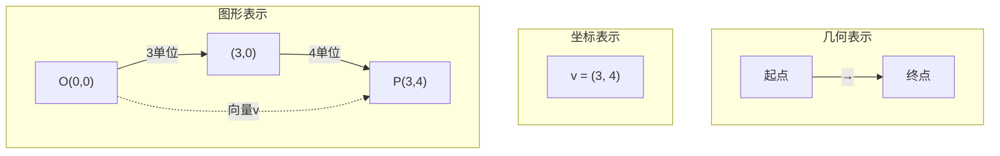

### 3. 向量的基本运算

#### 向量加法：接力赛跑 🏃‍♂️
```
第一棒：向东跑3米，向北跑4米 → a = (3, 4)
第二棒：向东跑1米，向北跑2米 → b = (1, 2)
总路程：a + b = (3+1, 4+2) = (4, 6)
```

##### 🎨 可视化：向量加法的平行四边形法则

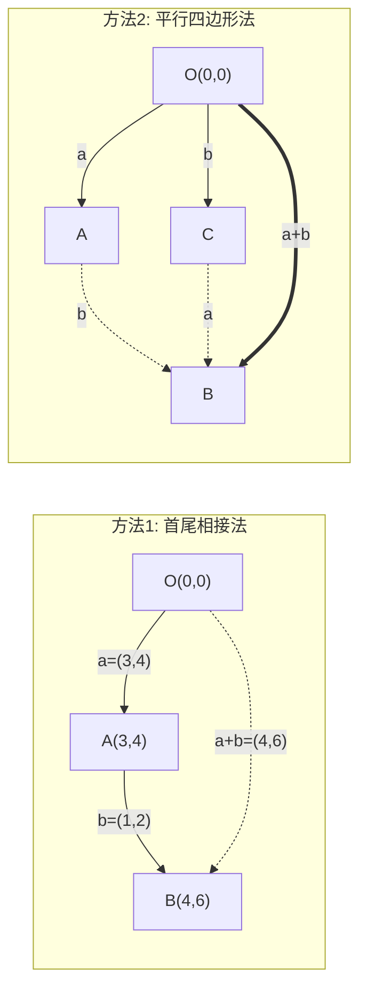

#### 向量数乘：复制粘贴 📋
```
原向量：v = (2, 3)
放大2倍：2v = (4, 6)  // 像照片放大
缩小一半：0.5v = (1, 1.5)  // 像照片缩小
反向：-v = (-2, -3)  // 像照镜子
```

##### 🎨 可视化：向量数乘的效果

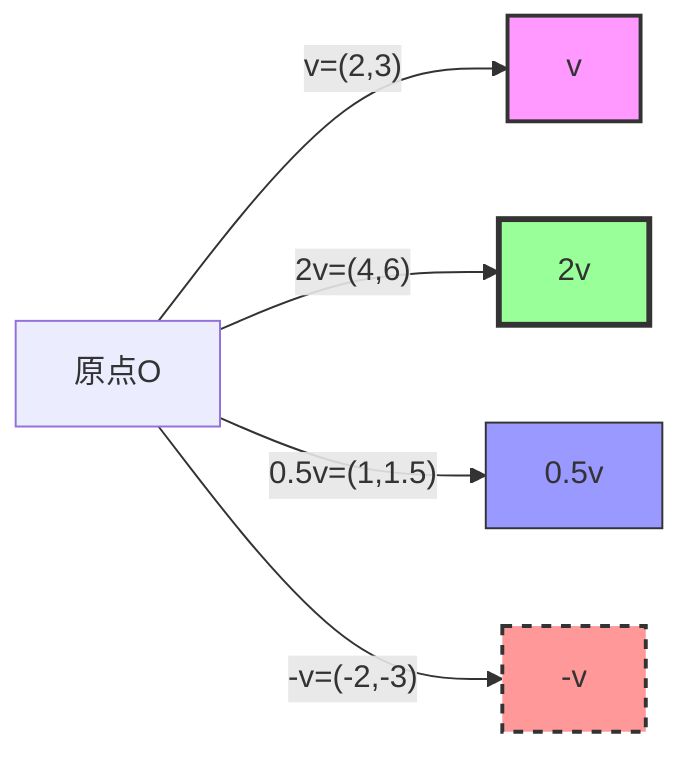

## 🎨 核心概念可视化总结

### 向量运算全景图

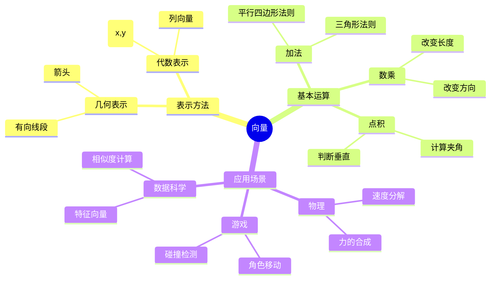

## 🎮 趣味案例

在《愤怒的小鸟》游戏中，小鸟的飞行轨迹就是向量的完美应用！

```
初始速度向量：v = (vx, vy)
- vx：水平速度（决定飞多远）
- vy：垂直速度（决定飞多高）

重力影响：每一帧 vy 都会减少（重力加速度）
位置更新：新位置 = 旧位置 + 速度向量
```

### 案例2：无人机送外卖 🚁

```python
# 无人机从餐厅到你家的向量路径
餐厅位置 = (0, 0)
你家位置 = (300, 400)  # 东300米，北400米

# 飞行向量
飞行向量 = 你家位置 - 餐厅位置 = (300, 400)

# 飞行距离（向量的模）
距离 = √(300² + 400²) = 500米

# 如果风向量是 wind = (-50, 0)（向西50米/分钟）
# 实际飞行向量 = 理想向量 + 风的影响
```

#### 🎨 可视化：无人机路径规划

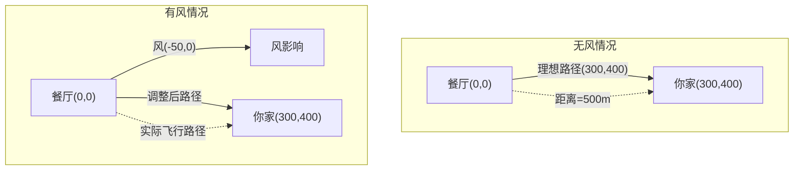

## 🧮 经典例题

### 例题1：向量加法与画图

**题目**：已知向量 a = (2, 1)，b = (1, 3)，求 a + b 并画图表示。

**解答**：
```
a + b = (2+1, 1+3) = (3, 4)

画图步骤：
1. 从原点画向量a：向右2格，向上1格
2. 从a的终点画向量b：向右1格，向上3格
3. 从原点到b的终点就是a+b
```

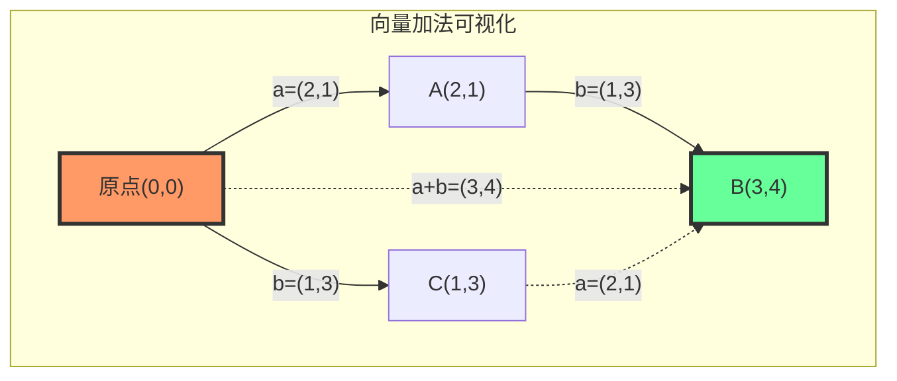

##### 🎨 坐标系中的向量表示

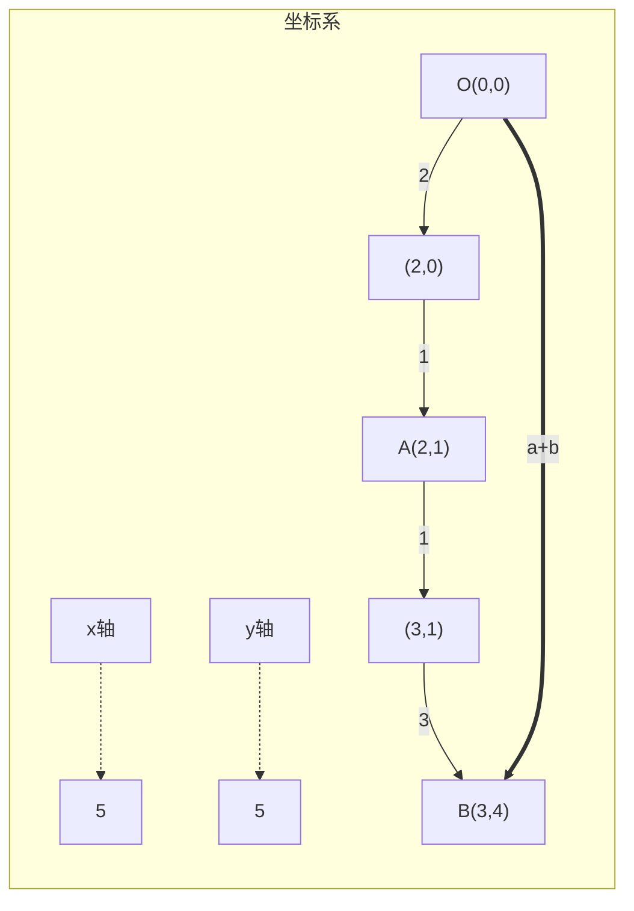

### 例题2：向量的模（长度）

**题目**：求向量 v = (3, 4) 的模。

**解答**：
```
|v| = √(3² + 4²) = √(9 + 16) = √25 = 5

趣味记忆：这是著名的"勾三股四弦五"！
```

### 例题3：向量的点积（内积）

**题目**：计算向量 a = (2, 3) 和 b = (4, 1) 的点积。

**解答**：
```
a·b = 2×4 + 3×1 = 8 + 3 = 11

几何意义：
- 如果点积 > 0：两向量夹角小于90°（朋友关系）
- 如果点积 = 0：两向量垂直（陌生人关系）
- 如果点积 < 0：两向量夹角大于90°（背道而驰）
```

#### 🎨 可视化：点积的几何意义

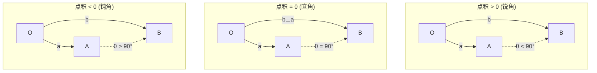

##### 🎯 点积计算过程动画

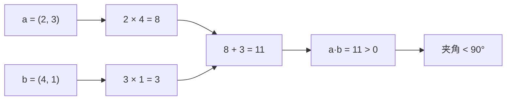

## 🎯 练习题

### 基础题

1. **向量运算**
   - 已知 a = (1, 2)，b = (3, -1)，求：
     - a) a + b
     - b) a - b
     - c) 2a + 3b

2. **向量的模**
   - 求下列向量的模：
     - a) v = (5, 12)
     - b) u = (1, 1)
     - c) w = (-3, 4)

3. **点积计算**
   - 计算下列向量的点积：
     - a) (2, 3)·(1, 4)
     - b) (1, 0)·(0, 1)
     - c) (3, -2)·(2, 3)

### 应用题

4. **导航问题**
   小红从学校出发，先向东走200米到图书馆，再向北走150米到食堂。
   - a) 用向量表示从学校到食堂的路径
   - b) 计算从学校直接到食堂的距离

#### 🎨 导航问题可视化

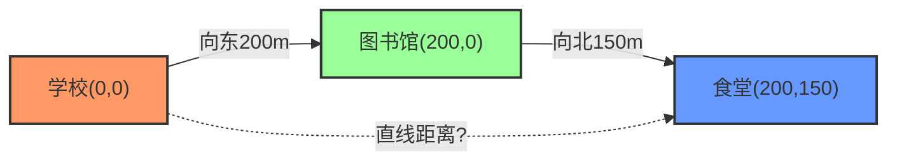

5. **游戏物理**
   一个游戏角色的速度是 v = (3, 4) 像素/帧，受到风的影响 w = (-1, 0)。
   - a) 求角色的实际移动速度
   - b) 经过10帧后，角色移动了多少距离？

#### 🎨 游戏物理可视化

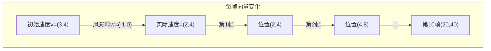

### 思考题

6. **向量垂直**
   已知向量 a = (2, 3)，求一个与 a 垂直的向量 b。
   提示：两向量垂直时，点积为0。

## 📝 答案

### 基础题答案

1. **向量运算**
   - a) a + b = (1+3, 2+(-1)) = (4, 1)
   - b) a - b = (1-3, 2-(-1)) = (-2, 3)
   - c) 2a + 3b = (2×1, 2×2) + (3×3, 3×(-1)) = (2, 4) + (9, -3) = (11, 1)

2. **向量的模**
   - a) |v| = √(5² + 12²) = √(25 + 144) = √169 = 13
   - b) |u| = √(1² + 1²) = √2 ≈ 1.414
   - c) |w| = √((-3)² + 4²) = √(9 + 16) = √25 = 5

3. **点积计算**
   - a) (2, 3)·(1, 4) = 2×1 + 3×4 = 2 + 12 = 14
   - b) (1, 0)·(0, 1) = 1×0 + 0×1 = 0（两向量垂直！）
   - c) (3, -2)·(2, 3) = 3×2 + (-2)×3 = 6 - 6 = 0（又是垂直！）

### 应用题答案

4. **导航问题**
   - a) 学校→图书馆：(200, 0)；图书馆→食堂：(0, 150)
        总路径向量：(200, 0) + (0, 150) = (200, 150)
   - b) 直线距离 = √(200² + 150²) = √(40000 + 22500) = √62500 = 250米

5. **游戏物理**
   - a) 实际速度 = v + w = (3, 4) + (-1, 0) = (2, 4) 像素/帧
   - b) 10帧移动距离 = 10 × |(2, 4)| = 10 × √(4 + 16) = 10 × √20 ≈ 44.7像素

### 思考题答案

6. **向量垂直**
   设 b = (x, y)，由 a·b = 0 得：
   2x + 3y = 0
   可取 x = 3, y = -2，所以 b = (3, -2)
   
   验证：(2, 3)·(3, -2) = 6 - 6 = 0 ✓

## 🎪 趣味拓展

### 向量的"超能力"

1. **向量可以描述任何"方向+大小"的事物**
   - 力的方向和大小
   - 速度的方向和快慢
   - 电场、磁场的方向和强度

2. **向量是高维空间的钥匙**
   - 2D向量：(x, y) - 平面世界
   - 3D向量：(x, y, z) - 立体世界
   - nD向量：(x₁, x₂, ..., xₙ) - 数据科学的世界！

#### 🎨 可视化：向量在不同维度空间

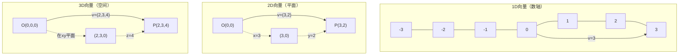

### 推荐资源

1. **视频**
   - 3Blue1Brown: "向量是什么？"
   - Khan Academy: 向量基础课程

2. **互动工具**
   - GeoGebra: 向量可视化
   - PhET: 向量加法模拟器

3. **编程实践**
   ```python
   import numpy as np
   import matplotlib.pyplot as plt
   
   # 创建向量
   a = np.array([2, 3])
   b = np.array([1, 4])
   
   # 向量运算
   print(f"a + b = {a + b}")
   print(f"点积 = {np.dot(a, b)}")
   print(f"|a| = {np.linalg.norm(a)}")
   
   # 可视化向量
   plt.figure(figsize=(8, 8))
   plt.quiver(0, 0, a[0], a[1], angles='xy', scale_units='xy', scale=1, color='red', label='向量a')
   plt.quiver(0, 0, b[0], b[1], angles='xy', scale_units='xy', scale=1, color='blue', label='向量b')
   plt.quiver(0, 0, (a+b)[0], (a+b)[1], angles='xy', scale_units='xy', scale=1, color='green', label='a+b')
   
   plt.xlim(-1, 5)
   plt.ylim(-1, 8)
   plt.grid(True)
   plt.legend()
   plt.axis('equal')
   plt.title('向量可视化')
   plt.show()
   ```

#### 🎮 交互式向量计算器

```python
class VectorCalculator:
    """简单的向量计算器"""
    
    def __init__(self):
        self.vectors = {}
    
    def add_vector(self, name, x, y):
        """添加一个向量"""
        self.vectors[name] = np.array([x, y])
        print(f"向量 {name} = ({x}, {y}) 已添加")
    
    def add(self, v1_name, v2_name):
        """向量加法"""
        v1 = self.vectors[v1_name]
        v2 = self.vectors[v2_name]
        result = v1 + v2
        print(f"{v1_name} + {v2_name} = {result}")
        return result
    
    def dot(self, v1_name, v2_name):
        """向量点积"""
        v1 = self.vectors[v1_name]
        v2 = self.vectors[v2_name]
        result = np.dot(v1, v2)
        print(f"{v1_name} · {v2_name} = {result}")
        
        # 判断关系
        if result > 0:
            print("→ 两向量夹角小于90°（锐角）")
        elif result == 0:
            print("→ 两向量垂直！")
        else:
            print("→ 两向量夹角大于90°（钝角）")
        
        return result
    
    def magnitude(self, v_name):
        """计算向量的模"""
        v = self.vectors[v_name]
        mag = np.linalg.norm(v)
        print(f"|{v_name}| = {mag:.2f}")
        return mag
    
    def angle(self, v1_name, v2_name):
        """计算两向量夹角"""
        v1 = self.vectors[v1_name]
        v2 = self.vectors[v2_name]
        
        cos_angle = np.dot(v1, v2) / (np.linalg.norm(v1) * np.linalg.norm(v2))
        angle_rad = np.arccos(cos_angle)
        angle_deg = np.degrees(angle_rad)
        
        print(f"{v1_name} 和 {v2_name} 的夹角 = {angle_deg:.1f}°")
        return angle_deg
    
    def visualize(self):
        """可视化所有向量"""
        plt.figure(figsize=(10, 10))
        colors = ['red', 'blue', 'green', 'orange', 'purple']
        
        for i, (name, vector) in enumerate(self.vectors.items()):
            color = colors[i % len(colors)]
            plt.quiver(0, 0, vector[0], vector[1], 
                      angles='xy', scale_units='xy', scale=1, 
                      color=color, label=f'{name}={vector}', 
                      width=0.005, headwidth=3)
        
        # 设置坐标轴
        all_vectors = list(self.vectors.values())
        if all_vectors:
            max_val = max(max(abs(v[0]), abs(v[1])) for v in all_vectors)
            plt.xlim(-max_val*1.2, max_val*1.2)
            plt.ylim(-max_val*1.2, max_val*1.2)
        
        plt.grid(True, alpha=0.3)
        plt.axhline(y=0, color='k', linewidth=0.5)
        plt.axvline(x=0, color='k', linewidth=0.5)
        plt.legend(loc='best')
        plt.axis('equal')
        plt.title('向量可视化')
        plt.xlabel('x')
        plt.ylabel('y')
        plt.show()

# 使用示例
calc = VectorCalculator()
calc.add_vector('a', 3, 4)
calc.add_vector('b', 4, 3)
calc.add_vector('c', -3, 4)

calc.add('a', 'b')
calc.dot('a', 'b')
calc.dot('a', 'c')
calc.angle('a', 'b')
calc.magnitude('a')
calc.visualize()
```

## 🎬 本章总结

向量就像是数学世界的GPS，它不仅告诉你"多少"，还告诉你"往哪儿"。掌握了向量，你就掌握了描述运动、变化和方向的强大工具！

下一章，我们将进入更加神奇的矩阵帝国，看看向量们如何组队变成矩阵，创造出更多奇迹！🎭

---
💡 **学习小贴士**：把向量想象成你最熟悉的事物——从家到学校的路线、游戏中角色的移动、甚至是你追剧时的情绪起伏（开心+2，难过-3），都可以用向量来描述！