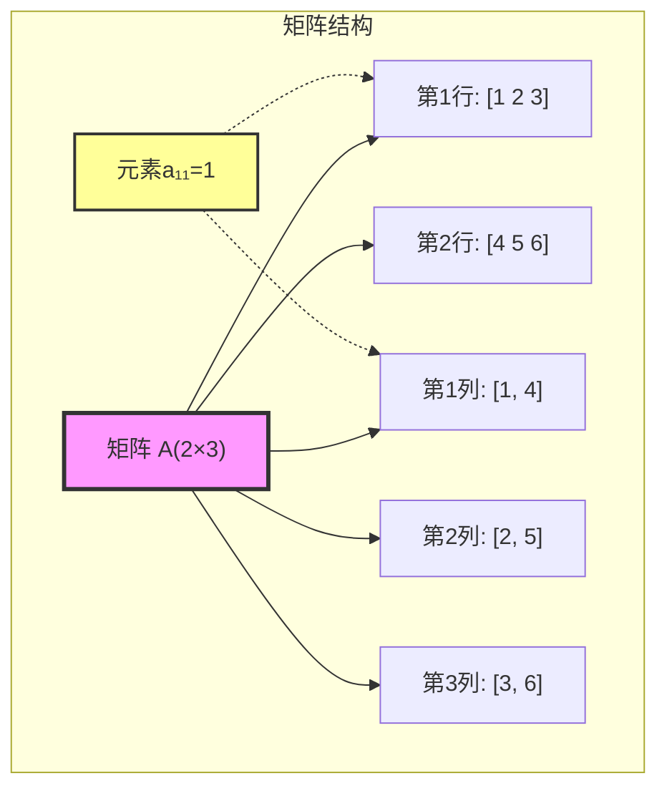
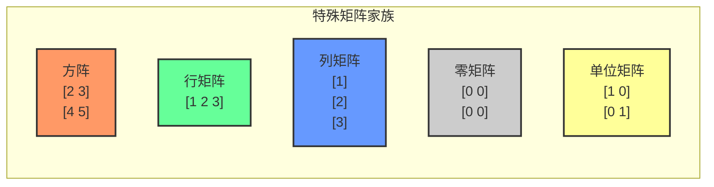
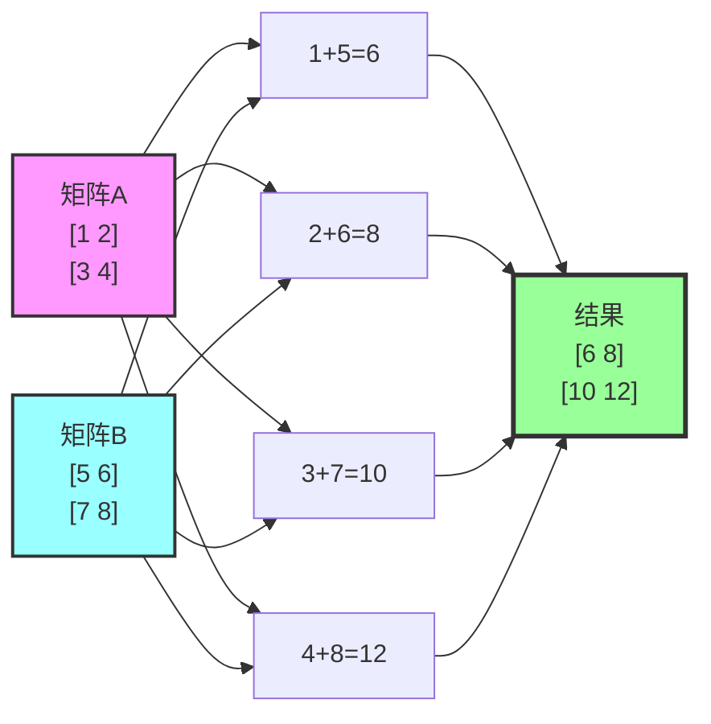
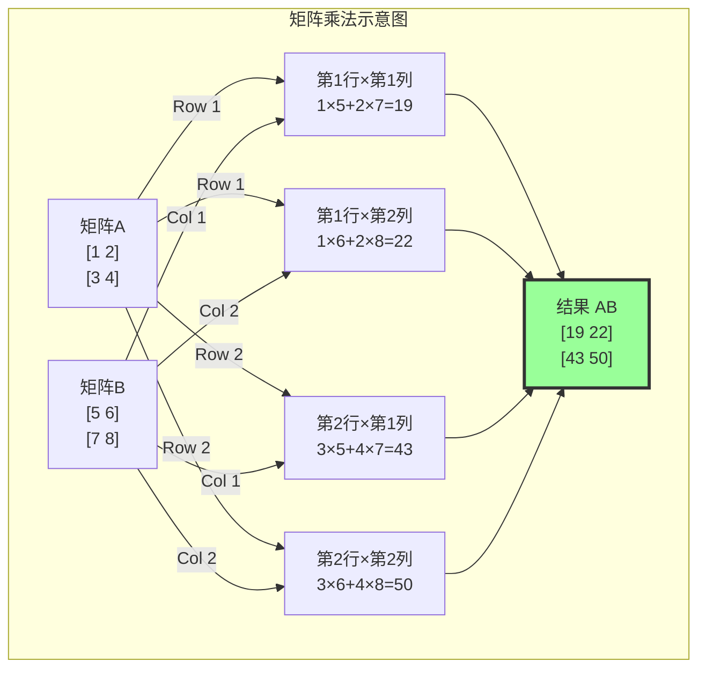
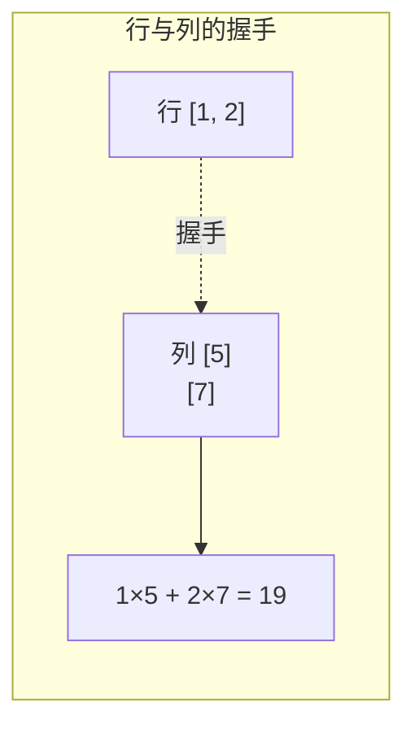
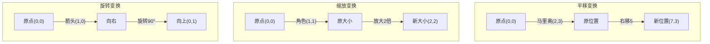
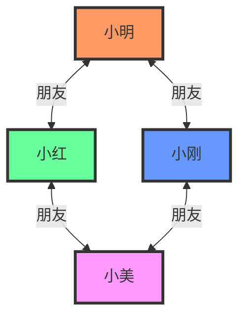
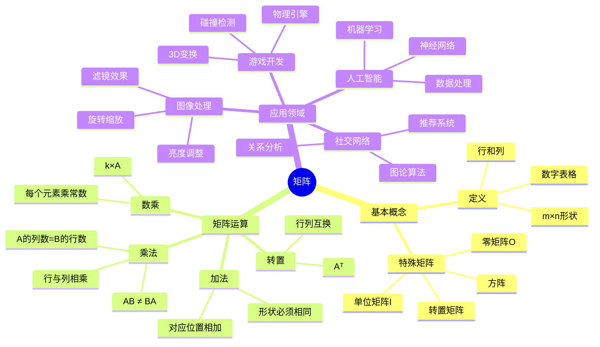

# 第2章：矩阵帝国 🏰

## 📖 开篇故事：黑客帝国的数字雨

还记得《黑客帝国》中那标志性的绿色数字雨吗？Neo看到的那些瀑布般流淌的字符，其实就是矩阵的艺术化表现！在数学世界里，矩阵就像是一个强大的帝国，统治着数据的组织与变换。

想象一下，如果向量是一个战士，那么矩阵就是一支军队——整齐排列，协同作战，威力倍增！

## 🎯 核心概念

### 1. 什么是矩阵？

**通俗解释**：
矩阵就是一个数字的"表格"，像Excel表格一样整齐排列。

```
单个数字：5（标量，0维）
一列数字：[5, 3, 7]（向量，1维）
数字表格：[1 2 3]（矩阵，2维）
          [4 5 6]
```

**生活类比**：
- 向量 = 购物清单（一列物品）
- 矩阵 = 座位表（行和列的组合）

### 2. 矩阵的"身份证"

```
矩阵 A = [1 2 3]  ← 第1行
         [4 5 6]  ← 第2行
         ↑ ↑ ↑
        第1列 第2列 第3列

这是一个 2×3 矩阵（读作"2行3列"）
记作：A₂ₓ₃
```

#### 🎨 可视化：矩阵的结构



**特殊矩阵家族**：
- 方阵：行数=列数的矩阵（像正方形）
- 行矩阵：只有1行的矩阵 [1 2 3]
- 列矩阵：只有1列的矩阵（就是列向量！）
- 零矩阵：全是0的矩阵（数学世界的"空白纸"）
- 单位矩阵：对角线是1，其他是0（数学世界的"1"）

#### 🎨 可视化：特殊矩阵图谱



### 3. 矩阵运算：军团作战法则

#### 矩阵加法：阵型叠加 ⚔️
```
A = [1 2]    B = [5 6]
    [3 4]        [7 8]

A + B = [1+5 2+6] = [6  8]
        [3+7 4+8]   [10 12]

规则：对应位置相加（像两张透明纸叠加）
```

##### 🎨 可视化：矩阵加法过程



#### 矩阵数乘：全军倍增 🎖️
```
A = [1 2]
    [3 4]

2A = [2×1 2×2] = [2 4]
     [2×3 2×4]   [6 8]

规则：每个元素都乘以这个数（全军装备升级！）
```

#### 矩阵乘法：战术配合 🤝

这是矩阵最神奇的运算！不是对应位置相乘，而是"行与列的约会"。

```
A = [1 2]    B = [5 6]
    [3 4]        [7 8]

AB的计算过程：
第1行×第1列：1×5 + 2×7 = 5 + 14 = 19
第1行×第2列：1×6 + 2×8 = 6 + 16 = 22
第2行×第1列：3×5 + 4×7 = 15 + 28 = 43
第2行×第2列：3×6 + 4×8 = 18 + 32 = 50

所以 AB = [19 22]
          [43 50]
```

**记忆技巧**：矩阵乘法就像"握手"——A的行伸出手，B的列伸出手，对应元素相乘再相加！

##### 🎨 可视化：矩阵乘法动态过程



##### 🎯 矩阵乘法的形象化理解



## 🎮 趣味案例

### 案例1：图像处理魔法 🖼️

在Instagram滤镜背后，就是矩阵在施展魔法！

```python
# 一张3×3的黑白图片（0=黑，255=白）
图片 = [100 150 200]
       [120 180 220]
       [140 160 240]

# 提高亮度：加法矩阵
亮度矩阵 = [50 50 50]
           [50 50 50]
           [50 50 50]

新图片 = 图片 + 亮度矩阵
       = [150 200 250]
         [170 230 255]  # 255是最亮
         [190 210 255]

# 降低对比度：乘法
新图片 = 0.5 × 图片  # 所有像素值减半
```

### 案例2：游戏中的变换矩阵 🎮

```
# 马里奥的位置
马里奥 = [x]
         [y]

# 向右移动的变换矩阵
右移 = [1 0 5]  # 向右移动5个单位
       [0 1 0]
       [0 0 1]

# 放大2倍的变换矩阵
放大 = [2 0 0]
       [0 2 0]
       [0 0 1]

# 旋转90度的变换矩阵
旋转 = [0 -1 0]
       [1  0 0]
       [0  0 1]
```

#### 🎨 可视化：游戏变换效果



### 案例3：社交网络分析 👥

```
朋友关系矩阵：
     小明 小红 小刚 小美
小明 [ 0   1   1   0 ]  # 小明认识小红和小刚
小红 [ 1   0   0   1 ]  # 小红认识小明和小美
小刚 [ 1   0   0   1 ]  # 小刚认识小明和小美
小美 [ 0   1   1   0 ]  # 小美认识小红和小刚

1表示认识，0表示不认识
这个矩阵可以分析：
```

#### 🎨 可视化：社交网络图


- 谁最受欢迎（列和最大）
- 谁认识最多人（行和最大）
- 共同好友（矩阵运算）
```

## 🧮 经典例题

### 例题1：矩阵基本运算

**题目**：已知
```
A = [1 2]    B = [3 1]
    [3 4]        [2 2]
```
求：(1) A + B  (2) 2A - B  (3) AB

**解答**：
```
(1) A + B = [1+3 2+1] = [4 3]
            [3+2 4+2]   [5 6]

(2) 2A - B = [2×1 2×2] - [3 1] = [2 4] - [3 1] = [-1 3]
             [2×3 2×4]   [2 2]   [6 8]   [2 2]   [4 6]

(3) AB计算过程：
    第1行×第1列：1×3 + 2×2 = 3 + 4 = 7
    第1行×第2列：1×1 + 2×2 = 1 + 4 = 5
    第2行×第1列：3×3 + 4×2 = 9 + 8 = 17
    第2行×第2列：3×1 + 4×2 = 3 + 8 = 11
    
    所以 AB = [7  5]
              [17 11]
```

### 例题2：矩阵的转置

**题目**：求矩阵A的转置
```
A = [1 2 3]
    [4 5 6]
```

**解答**：
转置就是"行变列，列变行"，像照镜子一样！

```
Aᵀ = [1 4]  ← 原来的第1列变成第1行
     [2 5]  ← 原来的第2列变成第2行
     [3 6]  ← 原来的第3列变成第3行
```

记忆技巧：把矩阵沿主对角线"翻折"过去！

### 例题3：单位矩阵的魔力

**题目**：验证单位矩阵的特性
```
I = [1 0]    A = [2 3]
    [0 1]        [4 5]
```
计算 IA 和 AI

**解答**：
```
IA = [1×2+0×4  1×3+0×5] = [2 3] = A
     [0×2+1×4  0×3+1×5]   [4 5]

AI = [2×1+3×0  2×0+3×1] = [2 3] = A
     [4×1+5×0  4×0+5×1]   [4 5]
```

发现：IA = AI = A
单位矩阵就像数字1，任何矩阵乘以它都不变！

## 🎯 练习题

### 基础题

1. **矩阵运算**
   已知：
   ```
   A = [2 1]    B = [1 -1]
       [3 4]        [2  3]
   ```
   计算：
   - a) A + B
   - b) A - B
   - c) 3A
   - d) AB
   - e) BA（注意：AB ≠ BA！）

2. **矩阵转置**
   求下列矩阵的转置：
   ```
   a) M = [1 2 3 4]
   
   b) N = [1 2]
          [3 4]
          [5 6]
   ```

3. **特殊矩阵**
   写出：
   - a) 3×3的单位矩阵
   - b) 2×4的零矩阵

### 应用题

4. **图像变换**
   一个2×2的图像矩阵表示4个像素的灰度值：
   ```
   图像 = [100 150]
          [200 250]
   ```
   - a) 所有像素增加亮度50
   - b) 对比度减半（所有值乘以0.5）
   - c) 图像转置（相当于沿对角线翻转）

5. **成绩统计**
   三个学生的数学、语文、英语成绩矩阵：
   ```
   成绩 = [85 90 88]  ← 小明
          [92 88 90]  ← 小红  
          [88 85 92]  ← 小刚
          数学 语文 英语
   ```
   - a) 每科平均分（提示：用列向量[1/3, 1/3, 1/3]左乘）
   - b) 每人总分（提示：用行向量[1, 1, 1]右乘）

### 思考题

6. **矩阵乘法的条件**
   如果A是m×n矩阵，B是p×q矩阵，什么情况下：
   - a) AB有意义？
   - b) BA有意义？
   - c) AB和BA都有意义？

## 📝 答案

### 基础题答案

1. **矩阵运算**
   ```
   a) A + B = [2+1  1+(-1)] = [3 0]
              [3+2  4+3]      [5 7]
   
   b) A - B = [2-1  1-(-1)] = [1  2]
              [3-2  4-3]      [1  1]
   
   c) 3A = [3×2  3×1] = [6  3]
           [3×3  3×4]   [9 12]
   
   d) AB = [2×1+1×2  2×(-1)+1×3] = [4  1]
           [3×1+4×2  3×(-1)+4×3]   [11 9]
   
   e) BA = [1×2+(-1)×3  1×1+(-1)×4] = [-1 -3]
           [2×2+3×3      2×1+3×4]      [13 14]
   
   注意：AB ≠ BA！矩阵乘法不满足交换律
   ```

2. **矩阵转置**
   ```
   a) Mᵀ = [1]
           [2]
           [3]
           [4]
   
   b) Nᵀ = [1 3 5]
           [2 4 6]
   ```

3. **特殊矩阵**
   ```
   a) I₃ₓ₃ = [1 0 0]
             [0 1 0]
             [0 0 1]
   
   b) O₂ₓ₄ = [0 0 0 0]
             [0 0 0 0]
   ```

### 应用题答案

4. **图像变换**
   ```
   a) 增加亮度：
      [100 150] + [50 50] = [150 200]
      [200 250]   [50 50]   [250 255]（注：255是最大值）
   
   b) 对比度减半：
      0.5 × [100 150] = [50  75]
            [200 250]   [100 125]
   
   c) 转置（对角线翻转）：
      [100 150]ᵀ = [100 200]
      [200 250]    [150 250]
   ```

5. **成绩统计**
   ```
   a) 每科平均分：
      [1/3 1/3 1/3] × [85 90 88] = [88.3 87.7 90]
                       [92 88 90]   (数学 语文 英语平均分)
                       [88 85 92]
   
   b) 每人总分：
      [85 90 88]   [1]   [263]  ← 小明总分
      [92 88 90] × [1] = [270]  ← 小红总分
      [88 85 92]   [1]   [265]  ← 小刚总分
   ```

### 思考题答案

6. **矩阵乘法的条件**
   - a) AB有意义：n = p（A的列数 = B的行数）
   - b) BA有意义：q = m（B的列数 = A的行数）
   - c) AB和BA都有意义：m = q 且 n = p（A和B都是方阵且同阶）

## 🎪 趣味拓展

### 矩阵的"超能力"

1. **矩阵可以表示任何线性变换**
   - 旋转、缩放、剪切、投影...
   - 3D游戏引擎的核心就是矩阵运算！

2. **矩阵是数据科学的基石**
   - 机器学习中的数据集就是矩阵
   - 神经网络的权重就是矩阵
   - 推荐系统用矩阵分解找到你的喜好

3. **矩阵的哲学意义**
   - 矩阵代表了"关系"和"变换"
   - 世界的本质可能就是一个巨大的矩阵？

### 推荐资源

1. **视频**
   - 3Blue1Brown: "矩阵乘法的本质"
   - Welch Labs: "想象第四维"

2. **游戏**
   - 2048（矩阵移动的完美体现）
   - 俄罗斯方块（矩阵旋转）

3. **编程实践**
   ```python
   import numpy as np
   import matplotlib.pyplot as plt
   
   # 创建矩阵
   A = np.array([[1, 2], [3, 4]])
   B = np.array([[5, 6], [7, 8]])
   
   # 矩阵运算
   print(f"A + B = \n{A + B}")
   print(f"A × B = \n{A @ B}")  # @符号表示矩阵乘法
   print(f"A的转置 = \n{A.T}")
   
   # 图像旋转示例
   angle = np.pi/4  # 45度
   rotation = np.array([[np.cos(angle), -np.sin(angle)],
                        [np.sin(angle), np.cos(angle)]])
   
   # 可视化矩阵乘法过程
   def visualize_matrix_multiplication(A, B):
       """可视化矩阵乘法过程"""
       fig, axes = plt.subplots(2, 3, figsize=(15, 10))
       
       # 显示原矩阵
       axes[0, 0].imshow(A, cmap='Blues', alpha=0.7)
       axes[0, 0].set_title('矩阵 A')
       for i in range(A.shape[0]):
           for j in range(A.shape[1]):
               axes[0, 0].text(j, i, str(A[i, j]), 
                              ha='center', va='center', fontsize=12)
       
       axes[0, 1].imshow(B, cmap='Reds', alpha=0.7)
       axes[0, 1].set_title('矩阵 B')
       for i in range(B.shape[0]):
           for j in range(B.shape[1]):
               axes[0, 1].text(j, i, str(B[i, j]), 
                              ha='center', va='center', fontsize=12)
       
       # 计算并显示结果
       C = A @ B
       axes[0, 2].imshow(C, cmap='Greens', alpha=0.7)
       axes[0, 2].set_title('结果 A × B')
       for i in range(C.shape[0]):
           for j in range(C.shape[1]):
               axes[0, 2].text(j, i, str(C[i, j]), 
                              ha='center', va='center', fontsize=12)
       
       # 显示计算过程
       axes[1, 0].text(0.5, 0.5, 
                       f'C[0,0] = {A[0,0]}×{B[0,0]} + {A[0,1]}×{B[1,0]} = {C[0,0]}',
                       ha='center', va='center', fontsize=10, 
                       transform=axes[1, 0].transAxes)
       axes[1, 0].set_title('计算过程 C[0,0]')
       
       axes[1, 1].text(0.5, 0.5, 
                       f'C[0,1] = {A[0,0]}×{B[0,1]} + {A[0,1]}×{B[1,1]} = {C[0,1]}',
                       ha='center', va='center', fontsize=10,
                       transform=axes[1, 1].transAxes)
       axes[1, 1].set_title('计算过程 C[0,1]')
       
       axes[1, 2].text(0.5, 0.5, 
                       f'C[1,0] = {A[1,0]}×{B[0,0]} + {A[1,1]}×{B[1,0]} = {C[1,0]}\n'
                       f'C[1,1] = {A[1,0]}×{B[0,1]} + {A[1,1]}×{B[1,1]} = {C[1,1]}',
                       ha='center', va='center', fontsize=10,
                       transform=axes[1, 2].transAxes)
       axes[1, 2].set_title('其他元素')
       
       for ax in axes.flat:
           ax.set_xticks([])
           ax.set_yticks([])
       
       plt.tight_layout()
       plt.show()
   
   # 使用示例
   visualize_matrix_multiplication(A, B)
   ```

#### 🎮 交互式矩阵计算器

```python
class MatrixCalculator:
    """矩阵计算器"""
    
    def __init__(self):
        self.matrices = {}
    
    def add_matrix(self, name, matrix):
        """添加矩阵"""
        self.matrices[name] = np.array(matrix)
        print(f"矩阵 {name} 已添加:")
        print(f"{self.matrices[name]}")
        print(f"形状: {self.matrices[name].shape}")
    
    def add(self, name1, name2):
        """矩阵加法"""
        A, B = self.matrices[name1], self.matrices[name2]
        if A.shape != B.shape:
            print(f"错误: 矩阵形状不匹配! {A.shape} vs {B.shape}")
            return None
        
        result = A + B
        print(f"{name1} + {name2} =")
        print(result)
        return result
    
    def multiply(self, name1, name2):
        """矩阵乘法"""
        A, B = self.matrices[name1], self.matrices[name2]
        if A.shape[1] != B.shape[0]:
            print(f"错误: 无法相乘! {A.shape} × {B.shape}")
            print(f"提示: A的列数({A.shape[1]}) ≠ B的行数({B.shape[0]})")
            return None
        
        result = A @ B
        print(f"{name1} × {name2} =")
        print(result)
        
        # 显示计算过程（仅对小矩阵）
        if A.shape[0] <= 2 and B.shape[1] <= 2:
            print("\n计算过程:")
            for i in range(A.shape[0]):
                for j in range(B.shape[1]):
                    terms = [f"{A[i,k]}×{B[k,j]}" for k in range(A.shape[1])]
                    calculation = " + ".join(terms)
                    print(f"  [{i},{j}]: {calculation} = {result[i,j]}")
        
        return result
    
    def transpose(self, name):
        """矩阵转置"""
        A = self.matrices[name]
        result = A.T
        print(f"{name}的转置 =")
        print(result)
        print(f"形状变化: {A.shape} → {result.shape}")
        return result
    
    def det(self, name):
        """计算行列式（仅方阵）"""
        A = self.matrices[name]
        if A.shape[0] != A.shape[1]:
            print(f"错误: 只有方阵才能计算行列式! 当前形状: {A.shape}")
            return None
        
        result = np.linalg.det(A)
        print(f"det({name}) = {result:.4f}")
        return result
    
    def inverse(self, name):
        """计算逆矩阵（仅可逆方阵）"""
        A = self.matrices[name]
        if A.shape[0] != A.shape[1]:
            print(f"错误: 只有方阵才可能有逆矩阵!")
            return None
        
        try:
            result = np.linalg.inv(A)
            print(f"{name}的逆矩阵 =")
            print(result)
            
            # 验证
            identity = A @ result
            print(f"\n验证: {name} × {name}⁻¹ =")
            print(identity)
            
            return result
        except np.linalg.LinAlgError:
            print(f"错误: 矩阵{name}不可逆（行列式为0）")
            return None
    
    def visualize_all(self):
        """可视化所有矩阵"""
        if not self.matrices:
            print("没有矩阵可显示")
            return
        
        n = len(self.matrices)
        cols = min(3, n)
        rows = (n + cols - 1) // cols
        
        fig, axes = plt.subplots(rows, cols, figsize=(5*cols, 4*rows))
        if n == 1:
            axes = [axes]
        elif rows == 1:
            axes = [axes]
        else:
            axes = axes.flatten()
        
        for i, (name, matrix) in enumerate(self.matrices.items()):
            ax = axes[i] if n > 1 else axes[0]
            
            # 只显示数值矩阵的热图
            if matrix.shape[0] <= 10 and matrix.shape[1] <= 10:
                im = ax.imshow(matrix, cmap='viridis', alpha=0.7)
                
                # 添加数值标注
                for row in range(matrix.shape[0]):
                    for col in range(matrix.shape[1]):
                        text = ax.text(col, row, f'{matrix[row, col]:.1f}',
                                     ha='center', va='center', 
                                     color='white', fontweight='bold')
                
                ax.set_title(f'{name} {matrix.shape}')
                ax.set_xlabel('列')
                ax.set_ylabel('行')
            else:
                ax.text(0.5, 0.5, f'{name}\n形状: {matrix.shape}', 
                       ha='center', va='center', transform=ax.transAxes,
                       fontsize=14)
                ax.set_title(f'矩阵 {name}')
            
            ax.set_xticks([])
            ax.set_yticks([])
        
        # 隐藏多余的子图
        for i in range(n, len(axes)):
            axes[i].set_visible(False)
        
        plt.tight_layout()
        plt.show()

# 使用示例
calc = MatrixCalculator()

# 添加矩阵
calc.add_matrix('A', [[1, 2], [3, 4]])
calc.add_matrix('B', [[5, 6], [7, 8]])
calc.add_matrix('I', [[1, 0], [0, 1]])  # 单位矩阵

# 进行运算
calc.add('A', 'B')
calc.multiply('A', 'B')
calc.multiply('B', 'A')  # 验证AB ≠ BA
calc.transpose('A')
calc.det('A')
calc.inverse('A')

# 可视化
calc.visualize_all()
```

## 🎨 矩阵运算全景图

### 矩阵帝国的知识地图



## 🎬 本章总结

矩阵不仅仅是数字的排列，它是描述关系、实现变换的强大工具。从Instagram滤镜到3D游戏，从社交网络到人工智能，矩阵无处不在！

记住：
- 矩阵加法 = 对应位置相加
- 矩阵乘法 = 行与列的"握手"
- 单位矩阵 = 矩阵世界的"1"
- 矩阵转置 = 沿对角线翻折

下一章，我们将揭开行列式的神秘面纱，看看如何用一个数字来概括整个矩阵的特性！🎩

---
💡 **学习小贴士**：把矩阵想象成军队阵型——每个数字是一个士兵，矩阵运算就是不同的战术配合。理解了阵型，就理解了矩阵！