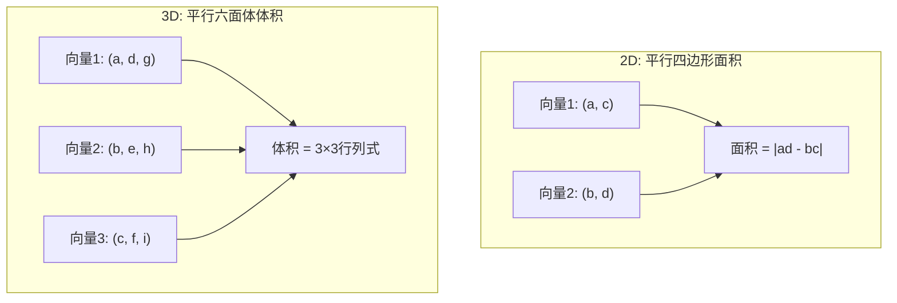
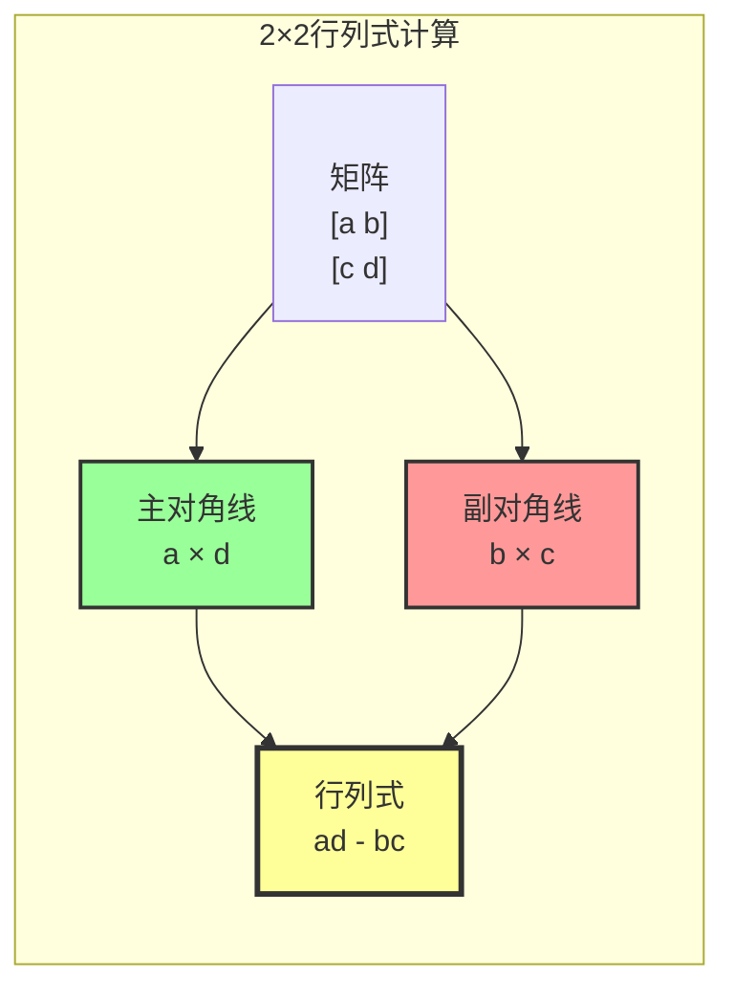
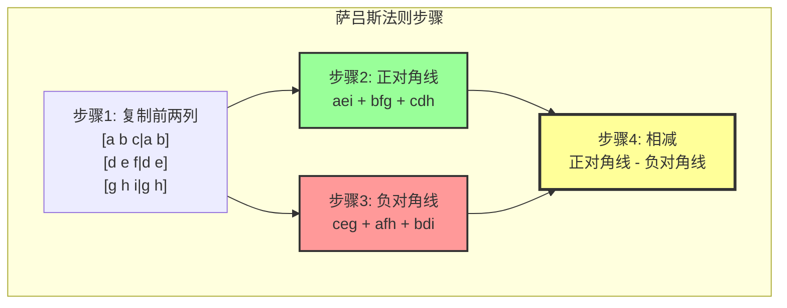
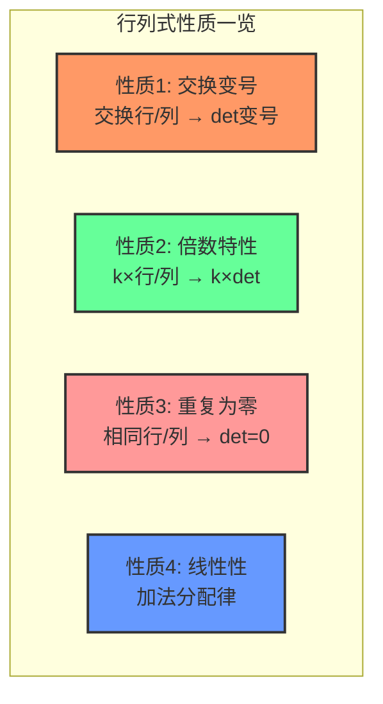
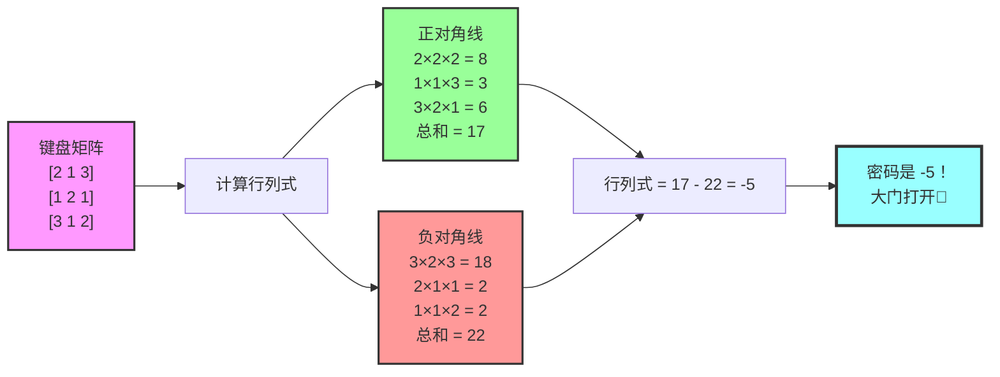
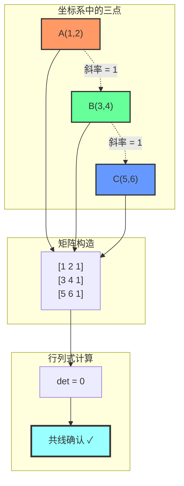
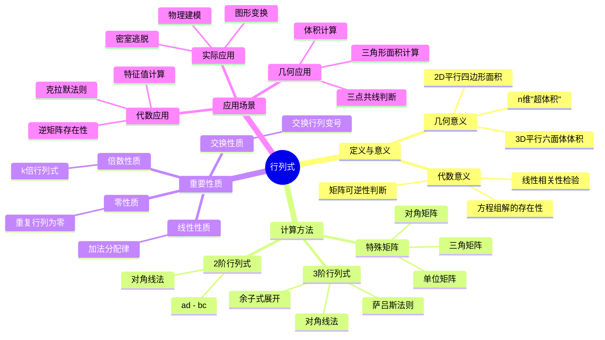

# 第3章：行列式的魔法 🎩

## 📖 开篇故事：莱布尼茨的密码箱

17世纪末，德国数学家莱布尼茨正在研究线性方程组。他突然意识到，每个方阵都藏着一个"密码"——一个能够揭示矩阵性质的神秘数字。这个数字就像是矩阵的"指纹"，能告诉我们矩阵是否"健康"（可逆）。

想象一下，如果矩阵是一栋房子，那么行列式就是这栋房子的"建筑质量分数"。分数为0？这房子要塌了（矩阵不可逆）！分数不为0？房子结实着呢（矩阵可逆）！

## 🎯 核心概念

### 1. 什么是行列式？

**通俗解释**：
行列式是一个方阵的"体检报告"，用一个数字概括矩阵的健康状况。

**几何意义**：
- 2×2矩阵的行列式 = 平行四边形的面积
- 3×3矩阵的行列式 = 平行六面体的体积

#### 🎨 可视化：行列式的几何意义



### 2. 行列式的计算魔法

#### 2阶行列式：交叉相乘法 ✖️

```
A = [a b]
    [c d]

det(A) = |a b| = ad - bc
         |c d|

记忆口诀：主对角线相乘 - 副对角线相乘
```

**形象记忆**：画个大叉叉！
```
a → b
↘ ↗
c   d

主对角线（↘）：a×d
副对角线（↗）：b×c
结果：ad - bc
```

##### 🎨 可视化：2×2行列式计算



#### 3阶行列式：萨吕斯法则（对角线法）🎲

```
A = [a b c]
    [d e f]
    [g h i]

复制前两列到右边：
[a b c | a b]
[d e f | d e]
[g h i | g h]

正对角线（↘）：aei + bfg + cdh
负对角线（↗）：ceg + afh + bdi

det(A) = (aei + bfg + cdh) - (ceg + afh + bdi)
```

##### 🎨 可视化：3×3行列式计算动画



### 3. 行列式的性质魔法书 📖

**性质1：行列式怕交换**
交换两行（或两列），行列式变号
```
|1 2|     |3 4|
|3 4| = 4-6 = -2  →  |1 2| = 6-4 = 2
```

**性质2：行列式爱倍数**
某一行（列）乘以k，行列式也乘以k
```
|2a 2b|   |a b|
|c  d | = 2|c d|
```

**性质3：行列式恨重复**
两行（列）相同，行列式为0
```
|1 2|
|1 2| = 2-2 = 0（房子塌了！）
```

**性质4：行列式的分身术**
```
|a+x b|   |a b|   |x b|
|c   d| = |c d| + |c d|
```

#### 🎨 可视化：行列式性质图表



## 🎮 趣味案例

### 案例1：密室逃脱的密码锁 🔐

你被困在密室里，墙上有个3×3的数字键盘：
```
[2 1 3]
[1 2 1]
[3 1 2]

#### 🎨 可视化：密码解密过程


```
提示：密码是这个矩阵的行列式！

**解密过程**：
```
使用萨吕斯法则：
正对角线：2×2×2 + 1×1×3 + 3×1×1 = 8 + 3 + 3 = 14
负对角线：3×2×3 + 2×1×1 + 1×1×2 = 18 + 2 + 2 = 22

密码 = 14 - 22 = -8
```

### 案例2：判断三点是否共线 📐

小明的三个朋友站在坐标上：
- A(1,2)
- B(3,4)  
- C(5,6)

他们站成一条直线了吗？

**判断方法**：
```
构造矩阵：
[1 2 1]  ← (x₁, y₁, 1)
[3 4 1]  ← (x₂, y₂, 1)
[5 6 1]  ← (x₃, y₃, 1)

计算行列式：
det = 1×(4×1-6×1) - 2×(3×1-5×1) + 1×(3×6-5×4)
    = 1×(-2) - 2×(-2) + 1×(-2)
    = -2 + 4 - 2 = 0

行列式=0，说明三点共线！
```

#### 🎨 可视化：三点共线检验



### 案例3：面积计算器 📏

已知三角形的三个顶点：A(0,0), B(3,0), C(1,2)

**面积公式**：
```
面积 = 1/2 × |行列式|

构造矩阵：
[0 0 1]
[3 0 1]
[1 2 1]

det = 0 - 0 + 1×(3×2-1×0) = 6

面积 = 1/2 × |6| = 3
```

## 🧮 经典例题

### 例题1：2阶行列式计算

**题目**：计算下列行列式
```
a) |2 3|    b) |1  2|    c) |x   2|
   |4 5|       |-1 3|       |3  x-1|
```

**解答**：
```
a) |2 3| = 2×5 - 3×4 = 10 - 12 = -2
   |4 5|

b) |1  2| = 1×3 - 2×(-1) = 3 + 2 = 5
   |-1 3|

c) |x   2| = x(x-1) - 2×3 = x² - x - 6
   |3  x-1|
```

### 例题2：3阶行列式计算

**题目**：计算行列式
```
|1 2 3|
|0 1 2|
|0 0 1|
```

**解答**：
这是上三角矩阵！行列式 = 对角线元素之积
```
det = 1 × 1 × 1 = 1

验证（用萨吕斯法则）：
正对角线：1×1×1 + 2×2×0 + 3×0×0 = 1
负对角线：3×1×0 + 1×2×0 + 2×0×1 = 0
结果：1 - 0 = 1 ✓
```

### 例题3：行列式性质应用

**题目**：已知
```
|a b c|
|d e f| = 5
|g h i|
```
求：
```
|2a 2b 2c|
|d  e  f |
|g  h  i |
```

**解答**：
第一行提取公因子2：
```
|2a 2b 2c|       |a b c|
|d  e  f | = 2 × |d e f| = 2 × 5 = 10
|g  h  i |       |g h i|
```

## 🎯 练习题

### 基础题

1. **2阶行列式计算**
   计算下列行列式：
   ```
   a) |3 4|    b) |5 -2|    c) |1 0|
      |2 1|       |1  3|       |0 1|
   ```

2. **3阶行列式计算**
   计算：
   ```
   a) |2 0 0|    b) |1 2 3|    c) |1 1 1|
      |0 3 0|       |4 5 6|       |2 3 4|
      |0 0 4|       |7 8 9|       |3 5 7|
   ```

3. **行列式性质**
   已知 |a b| = 6，求：
        |c d|
   ```
   a) |c d|    b) |3a 3b|    c) |a+c b+d|
      |a b|       |c   d |       |c   d  |
   ```

### 应用题

4. **几何应用**
   判断下列三点是否共线：
   - a) A(1,1), B(2,3), C(3,5)
   - b) A(0,0), B(1,2), C(2,3)

5. **面积计算**
   求由点A(1,1), B(4,2), C(3,5)构成的三角形面积。

### 思考题

6. **行列式为0的意义**
   如果一个3×3矩阵的行列式为0，从几何角度看意味着什么？

## 📝 答案

### 基础题答案

1. **2阶行列式计算**
   ```
   a) |3 4| = 3×1 - 4×2 = 3 - 8 = -5
      |2 1|
   
   b) |5 -2| = 5×3 - (-2)×1 = 15 + 2 = 17
      |1  3|
   
   c) |1 0| = 1×1 - 0×0 = 1（这是单位矩阵！）
      |0 1|
   ```

2. **3阶行列式计算**
   ```
   a) |2 0 0|
      |0 3 0| = 2×3×4 = 24（对角矩阵）
      |0 0 4|
   
   b) |1 2 3|
      |4 5 6| = 0（第3行 = 2×第2行 - 第1行）
      |7 8 9|
   
   c) |1 1 1|
      |2 3 4| = 1×(3×7-5×4) - 1×(2×7-3×4) + 1×(2×5-3×3)
      |3 5 7|   = 1×1 - 1×2 + 1×1 = 0
   ```

3. **行列式性质**
   ```
   a) |c d| = -|a b| = -6（交换两行，行列式变号）
      |a b|    |c d|
   
   b) |3a 3b| = 3|a b| = 3×6 = 18（提取公因子）
      |c   d |   |c d|
   
   c) |a+c b+d| = |a b| + |c d| = |a b| = 6
      |c   d  |   |c d|   |c d|   |c d|
      （第二个行列式两行相同，值为0）
   ```

### 应用题答案

4. **几何应用**
   ```
   a) 构造矩阵：
      |1 1 1|
      |2 3 1| = 1×(3×1-5×1) - 1×(2×1-3×1) + 1×(2×5-3×3)
      |3 5 1|   = 1×(-2) - 1×(-1) + 1×1 = -2 + 1 + 1 = 0
      三点共线！
   
   b) 构造矩阵：
      |0 0 1|
      |1 2 1| = 0 - 0 + 1×(1×3-2×2) = 1×(-1) = -1 ≠ 0
      |2 3 1|
      三点不共线！
   ```

5. **面积计算**
   ```
   构造矩阵：
   |1 1 1|
   |4 2 1| = 1×(2×1-5×1) - 1×(4×1-3×1) + 1×(4×5-3×2)
   |3 5 1|   = 1×(-3) - 1×1 + 1×14 = -3 - 1 + 14 = 10
   
   面积 = 1/2 × |10| = 5
   ```

### 思考题答案

6. **行列式为0的意义**
   - 2×2矩阵：两个向量共线，构成的平行四边形面积为0（退化成线段）
   - 3×3矩阵：三个向量共面，构成的平行六面体体积为0（退化成平面）
   - 一般意义：矩阵不可逆，方程组可能无解或有无穷多解

## 🎪 趣味拓展

### 行列式的"黑科技"

1. **克拉默法则**
   用行列式解方程组，像变魔术一样！
   ```
   对于方程组 Ax = b，如果det(A)≠0：
   xᵢ = det(Aᵢ)/det(A)
   其中Aᵢ是把A的第i列替换成b得到的矩阵
   ```

2. **向量叉积**
   ```
   a × b = |i  j  k |
           |a₁ a₂ a₃|
           |b₁ b₂ b₃|
   ```

3. **雅可比行列式**
   多元函数变换的"放大率"！

### 行列式与艺术

1. **分形艺术**：行列式可以描述分形的自相似变换
2. **音乐和弦**：和弦的和谐度可以用行列式来量化
3. **密码学**：行列式在希尔密码中的应用

### 推荐资源

1. **可视化工具**
   - Desmos：画出行列式的几何意义
   - GeoGebra：交互式行列式计算器

2. **编程实践**
   ```python
   import numpy as np
   import matplotlib.pyplot as plt
   from matplotlib.patches import Polygon
   
   # 计算行列式
   A = np.array([[1, 2, 3],
                 [4, 5, 6],
                 [7, 8, 9]])
   
   det_A = np.linalg.det(A)
   print(f"行列式 = {det_A}")  # 接近0！
   
   # 判断矩阵是否可逆
   if abs(det_A) < 1e-10:
       print("矩阵不可逆！")
   
   # 2D行列式的几何可视化
   def visualize_2d_determinant(matrix):
       """可视化2×2行列式的几何意义"""
       a, b = matrix[0]
       c, d = matrix[1]
       
       fig, (ax1, ax2) = plt.subplots(1, 2, figsize=(12, 5))
       
       # 左图：显示向量
       ax1.arrow(0, 0, a, c, head_width=0.1, head_length=0.1, 
                fc='red', ec='red', label=f'向量1: ({a}, {c})')
       ax1.arrow(0, 0, b, d, head_width=0.1, head_length=0.1, 
                fc='blue', ec='blue', label=f'向量2: ({b}, {d})')
       
       # 右图：显示平行四边形
       vertices = np.array([[0, 0], [a, c], [a+b, c+d], [b, d], [0, 0]])
       polygon = Polygon(vertices[:-1], alpha=0.3, facecolor='green')
       ax2.add_patch(polygon)
       ax2.plot(vertices[:, 0], vertices[:, 1], 'k-', linewidth=2)
       
       det_val = a*d - b*c
       area = abs(det_val)
       
       for ax in [ax1, ax2]:
           ax.grid(True, alpha=0.3)
           ax.set_xlim(-1, max(a+b, b) + 1)
           ax.set_ylim(-1, max(c+d, d) + 1)
           ax.set_aspect('equal')
       
       ax1.set_title(f'向量表示')
       ax2.set_title(f'平行四边形 (面积={area:.2f})')
       ax1.legend()
       
       plt.suptitle(f'行列式 = {det_val:.2f}')
       plt.tight_layout()
       plt.show()
   
   # 示例
   matrix_2d = np.array([[3, 1], [1, 2]])
   visualize_2d_determinant(matrix_2d)
   ```

#### 🎮 交互式行列式计算器

```python
class DeterminantCalculator:
    """行列式计算器"""
    
    def __init__(self):
        self.matrices = {}
    
    def add_matrix(self, name, matrix):
        """添加矩阵"""
        matrix = np.array(matrix)
        if matrix.shape[0] != matrix.shape[1]:
            print(f"错误: 只能计算方阵的行列式! 当前形状: {matrix.shape}")
            return
        
        self.matrices[name] = matrix
        print(f"矩阵 {name} 已添加:")
        print(matrix)
        print(f"这是一个 {matrix.shape[0]}×{matrix.shape[1]} 方阵")
    
    def calculate_2x2(self, matrix):
        """计算2×2行列式"""
        a, b = matrix[0]
        c, d = matrix[1]
        
        print(f"2×2行列式计算:")
        print(f"矩阵: [{a} {b}]")
        print(f"     [{c} {d}]")
        print(f"")
        print(f"主对角线: {a} × {d} = {a*d}")
        print(f"副对角线: {b} × {c} = {b*c}")
        print(f"行列式 = {a*d} - {b*c} = {a*d - b*c}")
        
        return a*d - b*c
    
    def calculate_3x3_sarrus(self, matrix):
        """用萨吕斯法则计算3×3行列式"""
        a, b, c = matrix[0]
        d, e, f = matrix[1]
        g, h, i = matrix[2]
        
        print(f"3×3行列式 (萨吕斯法则):")
        print(f"矩阵: [{a} {b} {c}]")
        print(f"     [{d} {e} {f}]")
        print(f"     [{g} {h} {i}]")
        print(f"")
        
        # 正对角线
        pos_diag1 = a * e * i
        pos_diag2 = b * f * g
        pos_diag3 = c * d * h
        positive = pos_diag1 + pos_diag2 + pos_diag3
        
        print(f"正对角线:")
        print(f"  {a}×{e}×{i} = {pos_diag1}")
        print(f"  {b}×{f}×{g} = {pos_diag2}")
        print(f"  {c}×{d}×{h} = {pos_diag3}")
        print(f"  正对角线和 = {positive}")
        print()
        
        # 负对角线
        neg_diag1 = c * e * g
        neg_diag2 = a * f * h
        neg_diag3 = b * d * i
        negative = neg_diag1 + neg_diag2 + neg_diag3
        
        print(f"负对角线:")
        print(f"  {c}×{e}×{g} = {neg_diag1}")
        print(f"  {a}×{f}×{h} = {neg_diag2}")
        print(f"  {b}×{d}×{i} = {neg_diag3}")
        print(f"  负对角线和 = {negative}")
        print()
        
        det = positive - negative
        print(f"行列式 = {positive} - {negative} = {det}")
        
        return det
    
    def calculate_det(self, name):
        """计算行列式"""
        if name not in self.matrices:
            print(f"矩阵 {name} 不存在!")
            return None
        
        matrix = self.matrices[name]
        size = matrix.shape[0]
        
        print(f"\n{'='*50}")
        print(f"计算矩阵 {name} 的行列式")
        print(f"{'='*50}")
        
        if size == 1:
            det = matrix[0, 0]
            print(f"1×1行列式 = {det}")
        elif size == 2:
            det = self.calculate_2x2(matrix)
        elif size == 3:
            det = self.calculate_3x3_sarrus(matrix)
        else:
            det = np.linalg.det(matrix)
            print(f"使用numpy计算 {size}×{size} 行列式: {det:.6f}")
        
        # 分析结果
        print(f"\n结果分析:")
        if abs(det) < 1e-10:
            print("  • 行列式 ≈ 0: 矩阵不可逆")
            print("  • 几何意义: 向量线性相关")
            if size == 2:
                print("  • 2D: 两向量共线，平行四边形面积为0")
            elif size == 3:
                print("  • 3D: 三向量共面，平行六面体体积为0")
        else:
            print(f"  • 行列式 = {det:.6f}: 矩阵可逆")
            print("  • 几何意义: 向量线性无关")
            if size == 2:
                print(f"  • 2D: 平行四边形面积 = |{det:.6f}|")
            elif size == 3:
                print(f"  • 3D: 平行六面体体积 = |{det:.6f}|")
        
        return det
    
    def check_collinear(self, points):
        """检查三点是否共线"""
        if len(points) != 3:
            print("需要3个点来检查共线性!")
            return
        
        print(f"\n检查三点共线性:")
        for i, (x, y) in enumerate(points):
            print(f"  点{chr(65+i)}: ({x}, {y})")
        
        # 构造矩阵
        matrix = np.array([[points[0][0], points[0][1], 1],
                          [points[1][0], points[1][1], 1],
                          [points[2][0], points[2][1], 1]])
        
        print(f"\n构造矩阵:")
        print(f"[{matrix[0,0]} {matrix[0,1]} {matrix[0,2]}]")
        print(f"[{matrix[1,0]} {matrix[1,1]} {matrix[1,2]}]")
        print(f"[{matrix[2,0]} {matrix[2,1]} {matrix[2,2]}]")
        
        det = np.linalg.det(matrix)
        print(f"\n行列式 = {det:.6f}")
        
        if abs(det) < 1e-10:
            print("结论: 三点共线! ✓")
        else:
            print("结论: 三点不共线! ✗")
        
        return abs(det) < 1e-10
    
    def triangle_area(self, points):
        """计算三角形面积"""
        if len(points) != 3:
            print("需要3个点来计算三角形面积!")
            return
        
        print(f"\n计算三角形面积:")
        for i, (x, y) in enumerate(points):
            print(f"  顶点{chr(65+i)}: ({x}, {y})")
        
        # 构造矩阵
        matrix = np.array([[points[0][0], points[0][1], 1],
                          [points[1][0], points[1][1], 1],
                          [points[2][0], points[2][1], 1]])
        
        det = np.linalg.det(matrix)
        area = abs(det) / 2
        
        print(f"\n行列式 = {det:.6f}")
        print(f"面积 = |{det:.6f}| / 2 = {area:.6f}")
        
        return area

# 使用示例
calc = DeterminantCalculator()

# 添加各种矩阵
calc.add_matrix('A', [[3, 1], [2, 4]])  # 2×2可逆矩阵
calc.add_matrix('B', [[2, 4], [1, 2]])  # 2×2不可逆矩阵
calc.add_matrix('C', [[1, 2, 3], [0, 1, 4], [5, 6, 0]])  # 3×3矩阵

# 计算行列式
calc.calculate_det('A')
calc.calculate_det('B')
calc.calculate_det('C')

# 几何应用
calc.check_collinear([(1, 1), (2, 3), (3, 5)])  # 共线
calc.check_collinear([(0, 0), (1, 2), (2, 3)])  # 不共线

calc.triangle_area([(0, 0), (3, 0), (0, 4)])  # 直角三角形
```

## 🎨 行列式知识全景图

### 行列式魔法的完整体系



## 🎬 本章总结

行列式就像是矩阵的"健康指数"：
- det(A) = 0：矩阵"生病了"（不可逆）
- det(A) ≠ 0：矩阵"健康"（可逆）

记住计算技巧：
- 2阶：画叉叉
- 3阶：萨吕斯法则（对角线法）
- 上/下三角：对角线元素相乘

行列式不仅是个数字，更是打开线性代数大门的钥匙！下一章，我们将用这把钥匙去解开线性方程组的谜题！🔍

---
💡 **学习小贴士**：把行列式想象成"矩阵的指纹"——每个矩阵都有独特的行列式值，这个值包含了矩阵的重要信息！