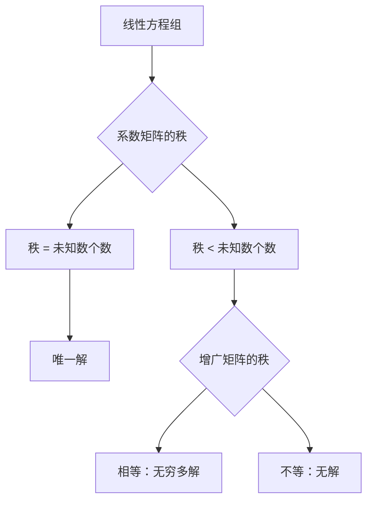

# 第4章：线性方程组的解密游戏 🔍

## 📖 开篇故事：高斯的天才时刻

传说高斯9岁时，老师为了让学生们安静，出了道题：计算1+2+3+...+100。其他同学埋头苦算，小高斯却很快给出答案：5050！他发现了规律：1+100=101, 2+99=101...共50对，所以答案是50×101=5050。

这种化繁为简的思想，后来被高斯用在解方程组上，创造了著名的"高斯消元法"——把复杂的方程组变成简单的阶梯形！

## 🎯 核心概念

### 1. 线性方程组是什么？

**生活场景**：
小明去水果店：
- 3个苹果 + 2个橙子 = 11元
- 2个苹果 + 3个橙子 = 14元
- 苹果和橙子各多少钱？

**数学表达**：
```
3x + 2y = 11
2x + 3y = 14

其中：x = 苹果单价，y = 橙子单价
```

### 2. 方程组的矩阵表示

把方程组写成矩阵形式 Ax = b：
```
[3 2] [x]   [11]
[2 3] [y] = [14]

系数矩阵A  未知数x  常数项b
```

### 3. 高斯消元法：解密的利器 🗝️

**核心思想**：把方程组变成"阶梯形"（上三角形），然后从下往上求解。

**三种基本操作**（不改变方程组的解）：
1. 交换两个方程的位置
2. 某个方程乘以非零常数
3. 某个方程加上另一个方程的倍数

### 4. 方程组解的三种情况



## 🎮 趣味案例

### 案例1：密室逃脱的三重密码锁 🔒

你需要找出三个密码x, y, z：
```
第一个提示：x + y + z = 6
第二个提示：2x - y + z = 3
第三个提示：x + 2y - z = 1
```

**解密过程**：
```
增广矩阵：
[1  1  1 | 6]
[2 -1  1 | 3]
[1  2 -1 | 1]

第一步：消除第一列
R₂ - 2R₁ → R₂：[0 -3 -1 | -9]
R₃ - R₁ → R₃： [0  1 -2 | -5]

[1  1  1 | 6]
[0 -3 -1 | -9]
[0  1 -2 | -5]

第二步：消除第二列
R₂ ÷ (-3) → R₂：[0 1 1/3 | 3]
R₃ - R₂ → R₃：  [0 0 -7/3 | -14]

最终：
[1  1  1   | 6]
[0  1  1/3 | 3]
[0  0 -7/3 | -14]

回代求解：
-7z/3 = -14 → z = 6
y + 6/3 = 3 → y = 1
x + 1 + 6 = 6 → x = -1

密码是：(-1, 1, 6)
```

### 案例2：化学配平方程式 ⚗️

配平化学方程：_CH₄ + _O₂ → _CO₂ + _H₂O

设系数为 a, b, c, d：
```
碳原子守恒：a = c
氢原子守恒：4a = 2d
氧原子守恒：2b = 2c + d

加上一个条件：a = 1（最简整数比）

方程组：
a - c = 0
4a - 2d = 0
2b - 2c - d = 0
a = 1

求解得：a=1, b=2, c=1, d=2
配平结果：CH₄ + 2O₂ → CO₂ + 2H₂O
```

### 案例3：投资组合问题 💰

小红有10万元，想投资三种产品：
- 股票：预期收益10%，高风险
- 债券：预期收益5%，中风险
- 存款：预期收益2%，无风险

要求：
1. 总投资10万元
2. 预期总收益6000元（6%）
3. 股票投资是存款的2倍

设股票x万、债券y万、存款z万：
```
x + y + z = 10
0.1x + 0.05y + 0.02z = 0.6
x = 2z

求解得：x=4, y=4, z=2
投资方案：股票4万、债券4万、存款2万
```

## 🧮 经典例题

### 例题1：高斯消元法

**题目**：用高斯消元法解方程组
```
2x + y - z = 1
x - y + 2z = 4
3x + 2y + z = 4
```

**解答**：
```
Step 1: 写出增广矩阵
[2  1 -1 | 1]
[1 -1  2 | 4]
[3  2  1 | 4]

Step 2: 第一列消元（交换R₁和R₂，让主元为1）
[1 -1  2 | 4]
[2  1 -1 | 1]
[3  2  1 | 4]

R₂ - 2R₁ → R₂：[0  3 -5 | -7]
R₃ - 3R₁ → R₃：[0  5 -5 | -8]

[1 -1  2 | 4]
[0  3 -5 | -7]
[0  5 -5 | -8]

Step 3: 第二列消元
R₂ ÷ 3 → R₂：[0 1 -5/3 | -7/3]
R₃ - 5R₂ → R₃：[0 0 10/3 | 3/3]

[1 -1  2   | 4]
[0  1 -5/3 | -7/3]
[0  0 10/3 | 1]

Step 4: 回代
10z/3 = 1 → z = 3/10
y - 5×(3/10)/3 = -7/3 → y = -2
x - (-2) + 2×(3/10) = 4 → x = 1.4

解：x = 7/5, y = -2, z = 3/10
```

### 例题2：判断方程组解的情况

**题目**：判断下列方程组解的情况
```
x + 2y + 3z = 1
2x + 4y + 6z = 2
3x + 6y + 9z = 4
```

**解答**：
```
增广矩阵：
[1 2 3 | 1]
[2 4 6 | 2]
[3 6 9 | 4]

消元：
R₂ - 2R₁ → [0 0 0 | 0]
R₃ - 3R₁ → [0 0 0 | 1]

化简后：
[1 2 3 | 1]
[0 0 0 | 0]
[0 0 0 | 1]

第三行表示：0 = 1（矛盾！）
所以方程组无解。

几何意义：三个平面平行，没有公共交点。
```

### 例题3：含参数的方程组

**题目**：讨论方程组的解（k为参数）
```
x + y + z = 3
x + 2y + kz = 4
x + y + 2z = k
```

**解答**：
```
增广矩阵：
[1 1 1 | 3]
[1 2 k | 4]
[1 1 2 | k]

消元：
[1 1 1   | 3]
[0 1 k-1 | 1]
[0 0 1   | k-3]

当k≠3时：
系数矩阵的秩 = 3 = 未知数个数
方程组有唯一解

当k=3时：
[1 1 1 | 3]
[0 1 2 | 1]
[0 0 1 | 0]

此时仍有唯一解：z=0, y=1, x=2
```

## 🎯 练习题

### 基础题

1. **高斯消元**
   解方程组：
   ```
   a) x + y = 5        b) 2x - y + z = 3
      2x - y = 1          x + y - z = 0
                          3x + y + 2z = 11
   ```

2. **判断解的情况**
   判断下列方程组是否有解，有多少解：
   ```
   a) x + y + z = 2    b) x - y + 2z = 1
      2x + 2y + 2z = 4     2x - 2y + 4z = 3
      3x + 3y + 3z = 6     3x - 3y + 6z = 3
   ```

3. **矩阵形式**
   将下列方程组写成矩阵形式Ax=b：
   ```
   3x - 2y + z = 7
   x + y - 2z = -2
   2x + 3y + z = 1
   ```

### 应用题

4. **配制溶液**
   实验室有三种溶液：
   - A溶液：浓度20%
   - B溶液：浓度30%
   - C溶液：浓度50%
   
   要配制300毫升浓度35%的溶液，且B溶液用量是A溶液的2倍。求各需多少毫升？

5. **交通流量**
   一个十字路口，进入的车流量等于离开的车流量：
   - 北进：x辆/分钟，南出：30辆/分钟
   - 东进：40辆/分钟，西出：y辆/分钟
   - 从北转东：z辆/分钟
   
   建立方程组并求解。

### 思考题

6. **克拉默法则**
   对于2×2方程组：
   ```
   ax + by = e
   cx + dy = f
   ```
   当ad-bc≠0时，证明：
   ```
   x = (ed-bf)/(ad-bc)
   y = (af-ec)/(ad-bc)
   ```

## 📝 答案

### 基础题答案

1. **高斯消元**
   ```
   a) 增广矩阵：[1  1 | 5]
               [2 -1 | 1]
      
      消元：[1  1 | 5]
           [0 -3 | -9]
      
      解得：y = 3, x = 2
   
   b) 增广矩阵：[2 -1  1 | 3]
               [1  1 -1 | 0]
               [3  1  2 | 11]
      
      最终化简为上三角形式
      解得：x = 1, y = 2, z = 3
   ```

2. **判断解的情况**
   ```
   a) 三个方程实际上是同一个方程的倍数
      秩(A) = 秩(A|b) = 1 < 3
      无穷多解（实际上是一个平面）
   
   b) 第二个方程 ≠ 2×第一个方程（右边不等）
      但第三个方程 = 3×第一个方程
      检查增广矩阵的秩，发现无解
   ```

3. **矩阵形式**
   ```
   A = [3 -2  1]    x = [x]    b = [7]
       [1  1 -2]        [y]        [-2]
       [2  3  1]        [z]        [1]
   ```

### 应用题答案

4. **配制溶液**
   设A溶液x毫升，B溶液y毫升，C溶液z毫升
   ```
   方程组：
   x + y + z = 300                  （总量）
   0.2x + 0.3y + 0.5z = 0.35×300   （浓度）
   y = 2x                           （条件）
   
   代入求解：
   x + 2x + z = 300 → 3x + z = 300
   0.2x + 0.6x + 0.5z = 105 → 0.8x + 0.5z = 105
   
   解得：x = 50, y = 100, z = 150
   ```

5. **交通流量**
   ```
   流量守恒：
   北进 = 南出 + 北转东：x = 30 + z
   东进 + 北转东 = 西出：40 + z = y
   
   简化得：
   x - z = 30
   y - z = 40
   
   这是欠定方程组，有无穷多解
   通解：x = 30+z, y = 40+z, z为任意非负数
   ```

### 思考题答案

6. **克拉默法则证明**
   ```
   原方程组的系数矩阵行列式：
   D = |a b| = ad - bc ≠ 0
       |c d|
   
   将b列替换为常数列：
   Dx = |e b| = ed - bf
        |f d|
   
   将a列替换为常数列：
   Dy = |a e| = af - ec
        |c f|
   
   根据克拉默法则：
   x = Dx/D = (ed-bf)/(ad-bc)
   y = Dy/D = (af-ec)/(ad-bc)
   ```

## 🎪 趣味拓展

### 线性方程组的应用场景

1. **计算机图形学**
   - 3D渲染中的光照计算
   - 物体变换的矩阵运算

2. **经济学**
   - 投入产出分析
   - 市场均衡模型

3. **工程学**
   - 电路分析（基尔霍夫定律）
   - 结构力学（力的平衡）

4. **数据科学**
   - 线性回归
   - 主成分分析

### 数值计算的陷阱

```python
# 病态方程组示例
import numpy as np

# 希尔伯特矩阵（病态矩阵）
n = 10
H = np.array([[1/(i+j+1) for j in range(n)] for i in range(n)])
b = np.sum(H, axis=1)

# 理论解应该是[1,1,...,1]
x = np.linalg.solve(H, b)
print(f"计算误差：{np.max(np.abs(x - 1))}")
# 误差可能很大！
```

### 推荐资源

1. **可视化工具**
   - 3Blue1Brown: "线性方程组的几何意义"
   - GeoGebra: 方程组求解器

2. **实践项目**
   - 编写自己的高斯消元法
   - 图像压缩（使用矩阵分解）
   - 推荐系统（协同过滤）

## 🎬 本章总结

线性方程组就像解谜游戏：
- **高斯消元法**：把复杂变简单的魔法
- **解的情况**：唯一解、无穷多解、无解
- **应用广泛**：从水果价格到火箭轨道

记住解题步骤：
1. 写出增广矩阵
2. 化为阶梯形（行消元）
3. 回代求解
4. 验证答案

下一章，我们将进入更抽象的向量空间，探索"空间"的真正含义！🌌

---
💡 **学习小贴士**：把高斯消元想象成"整理房间"——把杂乱的东西（方程）整理成整齐的架子（阶梯形），然后从上往下一个个收拾（回代）！